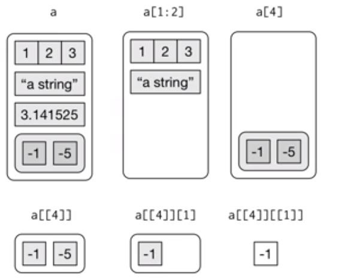
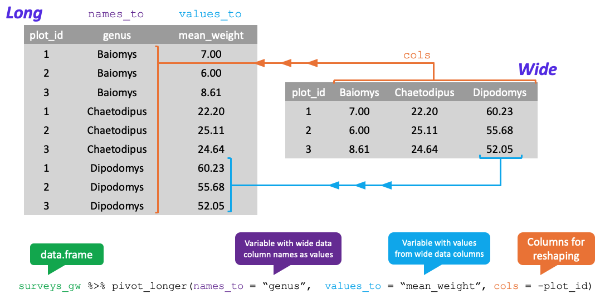

--- 
title: "Montana State University - Data Science Workshop"
author: "Data Carpentry contributors & MSU Data Science Workshops Team"
date: "August 8, 2025"
site: bookdown::bookdown_site
documentclass: book
bibliography: [book.bib, packages.bib]
# url: your book url like https://bookdown.org/yihui/bookdown
# cover-image: path to the social sharing image like images/cover.jpg
description: |
  Course materials for the all-day data science workshop where you'll learn to 
  use the R programming language for data science applications.
link-citations: yes
mainfont: Calibri
classoption:
  - twoside
  - openright
papersize: letter
linestretch: 1.25
fontsize: 10pt
geometry: 
  - top=1in
  - bottom=1in
  - right=0.75in
  - left=0.75in
  - bindingoffset=0.5in
  - asymmetric
---

# About {-}

## Data Science Workshop, August 8, 9am - 5pm {-}

Join us for an all-day workshop where you'll learn to use the R programming language for data science applications. These concepts will be presented in an interactive format, integrating instruction and computational practice. Montana University system graduate students, undergrads, staff, faculty, and community members are all welcome to join. The full schedule is below.  

**Location:** Montana State University, NAH 153 - with an online option
**Date:** Friday, August 8, 2025
**Time:** 9 a.m. - 5 p.m.

### Introduction to R - 9-10:50am  {-}

This session will start with the building blocks of using RStudio to create and explore the data structures available in R. Then we'll learn some basic tools for working with data in R. We will also discuss accessing and using R packages, and how to use R's built-in help interface.  

### Data Visualization in R - 11am-1pm  {-}

The ability to create meaningful and attractive data visualizations is an essential skill of data-intensive research. This session will give you an overview of the grammar of graphics plotting concepts from the ggplot2 package. We will explore ggplot's three plotting components, data, aesthetics, and geometries, for many univariate and multivariate graphics.   

### Lunch (provided) - 1-2pm {-}

### Coding with Generative AI - 2-3pm  {-}

In this session, we'll explore using Generative AI to write code. We'll also discuss writing prompts and responsible use of Generative AI for data science applications.  

### Data Wrangling in R - 3:10-5:00pm  {-}

In this session, you will learn how to manipulate data in R using the Tidyverse. You will learn to select, filter, mutate, arrange, and summarize data, build workflows that combine a series of operations, reshape data, join data, and more. 
The workshop is sponsored by the Library, Social Data Collection and Analysis Services, and Montana INBRE.


```{r include=FALSE}
# automatically create a bib database for R packages
knitr::write_bib(c(
  .packages(), 'bookdown', 'knitr', 'rmarkdown'
), 'packages.bib')
knitr::opts_chunk$set(tidy = TRUE, 
                      fig.align="center", 
                      fig.width=5, fig.height=2.5,
                      tidy.opts = list(width.cutoff = 80),
                      error=TRUE)
```

<!--chapter:end:index.Rmd-->

# Introduction to R

## Getting Started

The term `R` is used to refer to both the programming language as well as the 
software that interprets the scripts written using it. The learning curve may be
steeper than with other statistical software, but with `R` the results of your 
analysis or your plot does not rely on remembering what order you clicked on 
things, but instead on the written commands you generated. In `R` you will work
in scripts or with dynamic documents, with scripts within them (Rmd or Rnw files). 
Scripts may feel strange at first, but they make the steps you used in your 
analysis clear for both you and for someone who wants to give you feedback, 
further promoting the importance of reproducible science!  

RStudio is a free computer application that allows you access to the resources 
of `R`, while providing you with a comfortable working environment. There are 
many ways you can interact with `R`, but for many reasons RStudio has become 
the most popular. To function correctly, RStudio uses `R` behind the scenes, 
hence both need to be installed on your computer. Both `R` and `RStudio` are 
cross-platform, so that everyone's versions look and operate the same regardless
of their operating system! 

For this workshop, we will be making use of the RStudio that you will need to 
install on your computer. First you will want to go to https://cran.r-project.org/ 
to download for your specific operating system, run the `R` installer that you 
downloaded and then go to https://posit.co/download/rstudio-desktop/ to download 
and install RStudio.

For more assistance with getting set up, please check out the instructions 
provided by Data Carpentries at 
https://datacarpentry.org/R-ecology-lesson/#install-r-and-rstudio.
You need to have a computer that is running Linux, Windows, or a somewhat recent 
macOS. Unfortunately, a Chromebook or iPad are not sufficient for installing and 
running R.

However you get to it, RStudio has four default panels, where each can be viewed at the 
same time and has multiple tabs available.  

- the __Editor__ for your scripts and documents (top-left - will be available once
an RMD or script file is opened)  
- the `R` __Console__ (bottom-left)  
- your __Environment (Objects/Variables)/History__ (top-right)  
- and your __Files/Plots/Packages/Help/Viewer__ (bottom-right).

  

You can use the Tools -> Global Options -> Appearance tab to modify the colors 
and font sizes in RStudio.

## Working in `R`  

The document we provided for you is an Rmarkdown (.Rmd) document. It allows you 
to work in a reproducible fashion, with both code (placed in what are called code 
chunks) and descriptions of results in the same file. The grey sections that have 
three single quotes then `{r}` will delineate a code chunk. 

````
```{r}`r ''`
1 + 1
```  
````


You can add these with Insert -> `R` into a .Rmd file. Type all of your code in 
these code chunks and other documentation and interpretation of results outside 
of the code chunks (like we are doing here). Although there are more complex ways 
to work in RStudio, you should start today with saving this .Rmd  file into a 
folder that also contains any data and other figures you might want to read into 
this document. When you do that, RStudio will know where to look to read in the 
data so you do not need to know the path for its physical location on your 
computer. 

Once we are done with our local work, we can also use the `Knit` 
button to compile our work into HTML, Word (DOCX), or PDF documents. We will
demonstrate this at the end of the session - but this will only work if all 
the code "runs" and what we have provided you has some errors in it. One other
feature we've come to expect in modern document editors is live spell-checknig - 
I mean spell-checking - by underlining suspect words, which RStudio does without
flagging code and variable names. We will also discuss RStudio "Projects" that
take this one step further in terms of organizing your work built around this
markdown framework. It is important to understand the various ways to do your 
work in R using RStudio.

RStudio allows for you to execute commands directly from the code chunk in the 
document by using the __Ctrl + Enter__ (on Macs, __Cmd + Return__) shortcut. If
you place your cursor on the line in the code chunk that you would like to run 
and hit this shortcut, `R` will execute that line(s) of code for you. 
Alternatively, you can also execute code in the console (where the output of the
commands pops up). The difference between running code in the console and in the
document is that any code you execute in the console will be lost once you close
your `R` session. If you type code into the document's code chunks, it will be 
saved when you close your `R` session. Because we want to be able to go back and
re-run our code at the end of the session, it is better to type the command we
want `R` to run in the document and save it!

If `R` is ready to accept commands, the `R` console (in the bottom-left) will 
show a `>` prompt. When `R` receives a command (by typing, copy-pasting, or 
using the shortcut), it will execute it, and when finished will display the 
results and show the `>` symbol once again. If `R` is still waiting for you to 
provide it with additional instructions, a `+` will appear in the console. 
This should tell you that you didn't finish your command. You could have 
forgotten to close your parenthesis or a quotation. If this happens and you are
unsure of what went wrong, click inside the console and hit the `Esc` key. 
Then you can start over and figure out where you went wrong!

### Calculator  

__Practice__: Enter each of the following commands and confirm that the response
is the correct answer.  Try to do this in the console and by executing the code 
in the code chunk, both line by line and all at once.

```{r}  
1 + 2 

16*9

sqrt(2)
```

## Creating Objects 

These operations, however, are not very interesting. To do more useful things in
`R`, we need to assign values to an object. To create an object, we tell `R` the
object's name, followed by an assignment arrow (`<-`), and finally the value of 
the object. This would look something like this:

`x <- 6`

Once we execute/run this line of code, we notice that a new object appears in 
our environment window. This window shows all of the objects that you have 
created during your `R` session. The value of `x` appears next to it, since it 
is a scalar (single number as opposed to a set of numbers or a set of a set of
numbers). 

__Remarks:__  

* In the above code `<-` is the assignment operator. It assigns values on the 
right to objects on the left. So, after executing `year <- 6`, the value of 
`year` is `6`. The arrow can be read as `6` goes into `year`. For historical reasons,
you can also use `=` for assignments, but not in every context. Because of the 
slight differences in syntax, it is best practice to always use `<-` for 
assignments.  

    + In RStudio, typing `Alt` at the same time as the `-` key will write 
    `<-` in a single keystroke. Neat! (`Option` + `-` on MacOS)

* There are a few simple rules that apply when creating the same of a new object
(like we did above):  

    + `R` is case sensitive, so if you name your variable `cat` but then try to 
    run the code `Cat + 2`, you will get an error saying that `Cat` does not exist  
    + You also want your object's name to be explanatory, but not too long. 
    Think `current_temperature` verses `current_temp`. Do you really want to 
    type out temperature every time?  
    + Finally, you cannot begin any object's name with a number. You can end a 
    name with a number (e.g. `clean_data2`), but does that give you much 
    information about what is in the contents of `clean_data2` relative to 
    `clean_data`?    
    + The name cannot contain any punctuation symbols, except for `.` and `_` 
    (`.` is not recommended)  
    + You should not name your object the same as any common functions you may 
    use (`mean`, `sd,` etc.)  
    
* Using a consistent coding style makes your code clearer to read for your 
future self and your collaborators. 


## Working with Objects 

When you assign a value to an object (like we did previously) `R` does not output
anything by default. Writing the name of the object will output the value of the 
object you created. 

```{r}
x <- 6

x

```

Once the object has been created, you can use it! Run the following lines of code:

```{r}
2.2 * x

4 + x 

```

We can also overwrite an object's value, so that it has a new value. In the code
below create a new object `y` and then we give `x` a new value of 2. 

```{r}
y <-  x + 6

x <- 2 

```

### Exercise 1:

What is the current value of `y`? 12 or 8? 

1.  Create a code chunk (Hint, use __Ctrl + Alt + I__ on Windows, or 
__Cmd + Option + I__ on Mac, to insert a blank `R` code chunk), and 

2.  Write the code to display the value of the object.  

***Insert your code chunk here.***

## Working with Different Data Types 

A vector is the basic data type in `R`. A vector is a series of values, which 
can be either numbers or characters, but every entry of the vector must be the 
same data type. `R` can tell that you are building a vector when you use the 
`c()` function, which concatenates a series of entries together. 

```{r}
temps <- c(50, 55, 60, 65)
temps
```

To make a vector of characters, you are required to use quotation marks (`" "`) 
to indicate to `R` that the value you are using is not an object you already 
created in `R`. 

```{r}
animals <- c("cat", "dog", "bird", "fish")
animals
```

Important features of a vector is the type of data they store. Run the following
lines of code and decide what type of data the vectors contain. 

```{r}
class(temps)

class(animals)
```

### Exercise 2:

1.  Create a vector, named `dec`, that contains three decimal valued numbers. 

2.  Check: What data type does that vector contain?

```{r}
# Exercise 2 code here!


```

Another possible data type is a logical (Boolean) value. This type of data  
takes on values of `TRUE` and `FALSE`. But, we said that vectors could only be 
numbers or characters. If `TRUE` and `FALSE` don't have quotations around them,
then they aren't characters. So, then they must be numbers. What numbers do you 
think they are?  

```{r}
logic <- c(TRUE, FALSE, FALSE, TRUE)

class(logic)
```

### Exercise 3:

What happens when we try to mix different data types into one 
vector? Speculate what will happen when we run each of the following lines of code:

```{r}
num_char <- c(1, 2, 3, "a")

num_logic <- c(1, 2, 3, FALSE)

char_logic <- c("a", "b", "c", TRUE)

guess <- c(1, 2, 3, "4")
```

In each of these vectors, the two types of data were *coerced* into a single 
data type. This happens in a hierarchy, where some data types get preference 
over others. Can we draw a diagram of the hierarchy?  

## Lists  

While the elements of vectors have to be of the same data type, a list is a
special vector in `R` that allows for you to store a variety of types of 
objects. If you have a vector, a matrix, and/or a character, you can store all 
of them into one list object!

The arguments to the list function are the components of the list, where the 
components can be characters, vectors, matrices, or other data structures. 
Here, we create a list whose components are the three vectors we've been 
working with:

```{r}
my_first_list <- list(animals, temps, logic)
my_first_list

my_first_list[[1]]
```

We notice that when printing a list, the output looks a bit different. There 
are a whole bunch of brackets! Let's break them down. I like to think of a list
as a shelf with cubby holes. The cubby holes are the components of the list, 
but there are elements in each cubby.  

* To get to a specific component (cubby) of a list, you use the double brackets
next to the name of the list (e.g `my_first_list[[1]]`).  
* To access the elements inside each cubby, you then use single square brackets 
(e.g. `my_first_list[[1]][2]`). 



### Named Lists

```{r}
my_named_list <- list(title = "statistics", 
                      numbers = 1:10,
                      data = TRUE)
my_named_list
```

We see the output for a named list is slightly different. Instead of double 
brackets next to each component, there are now `$` and names of the items in the
list, these can be variables, parameters, or other information. This will help you understand the structure of data.frames (coming up next)!

## Importing Data  

* Use the __Import Dataset__ button in the __Environment__ tab  
* Choose the __From Text (base)__ option  
* Click on the __Browse__ button  
* Direct the computer to where you saved the `BlackfootFish.csv` data file, click __open__  
* It will bring up a preview of the data  
* Make sure that the box labeled "Strings as factors" is not checked  
* Click on the __Import__ button  

Notice the code that outputs in the console (the bottom left square). This is 
the code that you could have typed in the code chunk below to import the data 
yourself. Copy and paste the code that was output in the code chunk below.  

```{r}
# copy and paste the code that was used by R to import the data 
# be careful to only copy the code that is next to the > signs! 


```

The path provided can also be simplified to just include the file name - if the 
.Rmd and data are saved in the same folder. If you have any trouble reading in 
the data set, here is code that allows you to read the data from our github 
repository:

```{r}
BlackfootFish <- read.csv("data/BlackfootFish.csv")
```

## Structure of Data  

The data we will use is organized into data tables. When you imported the 
`BlackfootFish` data into RStudio it was saved as an object. You are able to
inspect the structure of the `BlackfootFish` object using functions built in to
`R` (no packages necessary).  

Run the following code. What is output from each of the following commands?

```{r}
class(BlackfootFish) ## What is the object class of the data?

dim(BlackfootFish) ## What is the first number represent? What about the second number?

names(BlackfootFish) ## What does this output refer to?

str(BlackfootFish) ## What is the structure of the data?
```

 
```{r}
summary(BlackfootFish) ## What is the data type of each variable in our dataset?

typeof(BlackfootFish) ## What is the storage mode of a data.frame?
```

When we inspect dataframes, or other objects in `R`, there are some general 
functions that are useful to check the content/structure of the data. 
Here are some:

- size:  
    + `dim(datasetname)`: rows and columns  
    + `nrow(datasetname)`: number of rows  
    + `ncol(datasetname)`: number of columns  
    + `length(datasetname$variable)`: length of a vector


- content:  
    + `head(datasetname)`: first 6 rows  
    + `tail(datasetname)`: last 6 rows  
    + `View(datasetname)`: opens viewer window in separate tab  
    

- names:  
    + `colnames(datasetname)`: column names of dataframe  
    + `rownames(datasetname)`: row names of dataframe  


- summary of content:  
    + `str(datasetname)`: structure of object and information about the columns  
    + `glimpse(datasetname)`: similar information to `str`, but neater output 
                              (requires `tibble` package)  
    + `summary(datasetname)`: summary statistics for each column  
  
*Note:* Many of these are generic functions that will work on other data types, 
not just on `data.frame`s. 

## Dataframes 

What is a dataframe? A dataframe is a type of `R` object and is the *de facto* 
structure of tabular data. You can create dataframes by hand, but most of us do 
not use `R` to input our data by hand. Instead, we import our data using `R` 
commands that read in spreadsheets (`read.csv`, `read_csv` (requires `readr` 
package), `read_excel` (requires `readxl` package), etc.). A dataframe is a 
set of columns, where each column is a vector. Thus, columns 
have the same data type *within* the column, but potentially different data 
types *across* columns. 

For example, the columns `trip`, `mark`, and `year` are integers (whole numbers),
`weight` and `length` are numeric (numbers with decimals), and `section` and 
`species` are characters. 

## Extracting Data  

If we were interested in accessing a specific variable in our dataset, we can 
use the `$` command. This command extracts the specified variable (on the right
of the `$` sign) from the dataset. When this is extracted, `R` views the variable
as a vector of entries, which is what the [1:18352] refers to.

```{r}  
years <- BlackfootFish$year 
## extracts year from the dataset and saves it into a new variable named years

str(years) ## using the new variable (remember case matters!)

## How would you determine how long the vector is?

```

Another method for accessing data in the dataset is using matrix notation 
([row, column]). If you look to your right in the __Environment__ window, you 
notice that RStudio tells you the dimensions of the `BlackfootFish` data. You can 
(roughly) view the dataset as a matrix of entries, with variable names for each 
of the columns. I could instead use bracket notation to perform the same task as
above, using the following code.  

```{r}  
years <- BlackfootFish[, 5] 
## This takes ALL rows of data but only the fifth column  
## Same as years <- BlackfootFish[1:18352, 5]

BlackfootFish[1, 5]

str(years)
```

### Practice: Working with dataframes

The following is a preview of the dataframe `df`: 

```{r}
df <- data.frame(
  x = c("H", "N", "T", "W", "V"), 
  y = c("May", "Oct", "Mar", "Aug", "Feb"),
  z = c(2010, 2015, 2018, 2017, 2019)
  )

df
```

#### Exercise 4:

What would be output if you entered: `df[3, ]`?   


#### Exercise 5:

What would you input to get an output of `2015`? Can you 
think of two ways to do it?


### Accessing Data

When we have a data frame or a list of objects, we can extract specific items by
specifying their position in the data frame or list. We saw how to do this with 
a single item, row, or column that we want to extract (`BlackfootFish[1, 5]`,
`df[3,]` or `BlackfootFish[, 5]`). We can specify two items, rows, or columns by
either using the fact that the two things we want are adjacent, or we can combine
what we want into a list that we can then use for extracting. We will continue to
use the indices to specify what we want to extract.

For example, `c(1, 2)` could identify the first two objects in a list. However they are adjacent so we could use `a:b` to indicate that we want everything from position `a` to position `b` in the list. So, `c(1,2)` would give the same items as `c(1:2)`.

#### Quick Check

Run the following code to see what you get. Play around with the first and last numbers to see what happens.

```{r}
c(1, 2, 3, 4, 5)
c(1:5)
c(5:1)
c(123:131)
c(3:-1)
```

When you want adjacent items, using the `a:b` notation is nicer than having to type out all of the values.

***What about non-adjacent items?***

For non-adjacent items, you just need to fall back on listing everything out. 
Say you want the first, third, and 9th item in a list. Then you can use 
`c(1, 3, 9)`.

Now that we've talked about how to create lists of the indices we want, how do 
we use these lists to extract items?

Using our data frame that we created above, to extract rows 2 and 3 we can use 
the notation `c(2, 3)` (or `c(2:3)` since they are adjacent).

```{r}
df[c(2,3), ]
```

If we want to extract rows 2 and 4, we can use this list of indices: `c(2, 4)`

```{r}
df[c(2,4),]
```

***NOTE:*** Instead of using indices you can also do the same technique with 
names if the rows or columns are named.

#### Exercise 6:

1.  How would you pull off only columns `x` and `y`? 
2.  What about pulling off only columns `x` and `z`?


#### Exercise 7:

How would you modify the script below, to get an output 
of `[1] 22 24`? 


```{r, eval = FALSE}
s <- c(22, 24, 49, 18, 1, 6)
s[]

```

#### Exercise 8:

See what would happen if you entered `s[3, ]`. How can you explain that result?  

```{r}

```

## Changing Data Type  

By default, when building or importing a data frame, the columns that contain 
characters (i.e., text) are coerced (= converted) into factors. Depending on what
you want to do with the data, you may want to keep these columns as character
type. To do so, read.csv() and read.table() have an argument called
`stringsAsFactors` which can be set to `FALSE`. This is what happened when we made
sure that the box `"stringsAsFactors"` was unchecked when importing our data. 

In most cases, it is preferable to set `stringsAsFactors = FALSE` when importing 
data and to convert as a factor only the columns that require this data type. 
But what is a factor? 

Consider the variables `species` and `section`. These variables represent a
broader class of what we call categorical variables. In `R` there are two ways 
to store this information, (1) as a series of `character` strings, or (2) as a 
`factor`. In the early days of coding in `R`, factors were more efficient than 
characters, since you only need to store the level of the factor each 
observation went with. 

Some functions in `R` require character vectors to be converted to factor
variables to correctly handle the information. We recommend that you convert
character vectors to factors intentionally (not automatically) only when 
necessary and always review and possibly modify the levels of the factor 
variable to make the levels as explicit as possible. 

In these data, species has four levels (RBT, WCT, Bull, and Brown). The levels 
are the unique values that variable can take on. If we want `R` to view this
variable as a factor instead of character, we need to change its data type.  

```{r factors, purl = TRUE}  
unique(BlackfootFish$species) ## tells you the unique values of species

BlackfootFish$speciesF <- factor(BlackfootFish$species) 
## creates a new variable that is the factor version of species

```

Now do the same thing for section. How many unique sections are there?

```{r}
unique(BlackfootFish$section) ## tells you the unique values of section

BlackfootFish$sectionF <- factor(BlackfootFish$section) 
## creates a new variable that is the factor version of section
```

There is also a function that will allow for you to specify the order of the 
levels of a factor! As we saw before, the `factor` function chooses the 
levels alphabetically. Suppose you would like for the species to be in the 
following order: Bull, Brown, RBT, and WCT. 

Using the `factor` function this would look like:

```{r, tidy = FALSE}
BlackfootFish$speciesF <- factor(BlackfootFish$species, 
                                levels = c("Bull", "Brown", "RBT", "WCT"))
```

If you want to check the order and names of the levels that are being used by 
a factor, the `levels()` function can be useful:

```{r, tidy = FALSE}
levels(BlackfootFish$speciesF)

```

### Practice: Working with factor variables 

#### Exercise 9:

Year was saved as an integer data type (1989 - 2006), but we 
may want to consider it to be a categorical variable (specifically a factor).
Write the `R` code to create a new variable called `yearF` that is a factor of
`year` (as you did with section and species). 

```{r}
BlackfootFish$yearF <- factor(BlackfootFish$year)
```

#### Exercise 10:

Now, verify that `yearF` is viewed as a categorical variable, 
with the same levels as `year`. (*Hint*: you have already used three functions 
that would do this for you)  

```{r}


```

An issue with factors lies with if/when you want to change it back to a 
number or character. In the code below I've decided that I don't want year 
to be a factor and want to change it back to numeric. What happens when I use 
the `as.numeric()` function on the `yearF` variable?  

```{r}
BlackfootFish$yearF <- factor(BlackfootFish$year)
```

```{r}
year_recover <- as.numeric(BlackfootFish$yearF)

ds <- data.frame(original = BlackfootFish$yearF, 
                 recovered = year_recover)
head(ds)

tail(ds)

```

## Packages  

As we mentioned previously, `R` has many packages, which people around the world
work on to provide and maintain new software and new capabilities for `R`. 
You will slowly accumulate a number of packages that you use often for a variety
of purposes. In order to use the elements (data, functions) of the packages, you
have to first install the package (only once on a given computer) and then load 
the package (every time).  

We're going to install a few packages that are often used.  

* Use the __Install__ button in the __Packages__ tab  
* Type in `remotes` and `tidyverse` into the blank line (separated by a comma)  
* Check the __Install dependencies__ box  
* Click on the __Install__ button  

There will be a large amount of output coming out of the console. This output is
`R` trying to download the package(s) you requested. Once the computer has 
downloaded the packages, it will tell you that 
"`The downloaded binary packages are in`", followed by the location of the files.

Now that the files are downloaded, we need to load them in order to use them. 
The following code will load each package, please run it!  

```{r packages}
library(remotes)
library(tidyverse)
```

Notice that when loading the `tidyverse` package that there is a large amount of
output. This output is telling you all of the other packages that are loaded in 
the `tidyverse` package, as well as the functions in the `tidyverse` package
that overwrite (mask) functions from base `R`.  

This is the process you go through if you ever find packages that you would 
like to use! Often packages that you install will need to be updated. To update
a package you can click on the "Tools" tab, then click on "Check for Package
Updates". This will bring up a window that will list all of the packages that 
have newer versions than what you have. Click on the packages that you wish to 
update, or click on the "Select All" button.

## Finding Help  

One of the chief reasons for `R`'s religious following is its wonderful 
documentation. If you need a function to complete a task (say find the variance), 
but are not quite sure how it's spelled, what arguments it takes, or what package
it lives in, don't fret! The `?` and `help()` commands are very powerful. For 
functions, placing the `?` before the name, will tell `R` to search for that 
name in all of the functions, in all of the packages you have installed.  

* If it finds _one_ __identical match__, it will display the help file for that 
function in the Help tab in the bottom-right corner.  
* If it finds _more than one_ __identical match__, it will display the functions,
in their respective packages, that you have to choose from.  
* If it finds _no_ __identical match__, it will tell you that "`No documentation 
for ____ in specified packages and libraries:,`" and suggests you use a `??` 
instead.  
    
    + A `??` in front of the function name will search __all of `R`__ for named 
    functions similar to what you typed.  
    + The output will tell you what package the function is in, as well as the 
    function's name (`package::function`).  

If you would like help on a particular package, say one that you just downloaded,
then you can use the same command(s) to get help.  These commands will load up 
a help page (in RStudio) in the Help pane. Each help page is broken down into 
sections:  

* Description: An extended description of what the function does.   
* Usage: The arguments of the function and their default values.     
* Arguments: An explanation of the object each argument is expecting.  
* Details: Any important details to be aware of.    
* Value: The object the function returns.      
* See Also: Any related functions that may be useful.    
* Examples: Some examples for how to use the function.

## Functions  

In `R` there are both functions that are built in (require no package to be 
loaded), as well as functions that are housed within specific packages. You have
already used a few built in functions to inspect the structure of the 
`BlackfootFish` data (`str`, `class`, `summary`). As we know, a function 
transforms an input (potentially multiple) into an output. You have to provide
`R` with the inputs (arguments) required for the function to generate an output.
The argument(s) inside a function happen after the `(` symbol. You know an 
object is a function when it is immediately followed by a  `(` and the 
corresponding closing `)` comes after the arguments are complete. The output of 
a function does not have to be numerical and it typically is not a single 
number, it can be a set of things or a dataset.   

Arguments describe the details of what a function is to do. Some functions take 
arguments that are specified by the user, or, if left undeclared, take on 
default values. These arguments are typically given names (as seen in the help
file), but the arguments are assumed to follow the order the function 
expects if they are not named (also stated in the help file). When naming an 
argument, the name of the argument is followed by an `=` sign and then the value
of the argument. Notice that here we are using the `=` to declare what value 
each argument is taking on, we **are not** creating a new variable with that 
value assigned to it.   

Suppose we wanted to create a vector of 10 zeros. To do this, we would use the 
`rep` function:  

```{r} 
# ?rep

rep(x = 0, times = 10) ## repeating 0 ten times

rep(times = 10, 0) ## switching order of arguments

rep(0, 10) ## no named arguments

rep(10, 0) ## not what we wanted!
```

Now let's look over some other functions that are often used: 


```{r} 
## takes a numerical input, but there are NA's in our data
mean(BlackfootFish$weight)

## review the help and add in the argument that removes the NA's
mean(BlackfootFish$weight, argument here! )  

## gives an error because the input is not the correct data type  
median(BlackfootFish$species) 

## takes multiple inputs separated by a comma
cor(BlackfootFish$length, BlackfootFish$weight) 

## Does cor have an option to remove NA's?
```

As seen in the functions above, some functions have *optional* arguments. If 
they are not specified by the user, then they take on their default value 
(`FALSE` for `na.rm`). These options control the behavior of the functions, 
such as whether it includes/excludes `NA` values. 

## Cleaning Data  

In many instances, you will deal with data that are not "clean". Based on the 
output we received from the `mean()` function, we know that there are `NA`'s in 
the `BlackfootFish` data, possibly across a variety of variables. Before we used 
`na.rm` as an option to remove `NA`'s *within* a function, but the `na.omit` 
function takes a dataframe and removes any `NA`'s from that dataset. Based on the
output below, how many rows in the `BlackfootFish` data have an `NA` present?  

```{r}

dim(BlackfootFish) ## gives the dimensions of the dataset in (row, column) format  

dim(na.omit(BlackfootFish)) 

## na.omit takes dataframes, matrices, and vectors and returns object 
## with incomplete cases removed - incomplete cases are ones with any NA's
```

__Remark:__ The computer is using an algorithm to return a dataset with no `NA` 
values anywhere in it. This algorithm goes through every row of the dataset and
(roughly) has the following steps,  

* Inspect the row to see if there is an `NA` anywhere in that row  
* If there is an `NA` in that row, the logical (`is.na`) evaluates to TRUE, and 
the row is deleted  
* If there are not any `NA`'s in that row, the logical evaluates to FALSE, and 
the row is retained  
* Once it has stepped through every row, the function outputs the "cleaned" 
dataframe

If we wish to remove all of the `NA`'s from the dataset, we can use the 
`na.omit` command from above. We can save the new "clean" dataset under a new name
(creating a new object) or under the same name as before (replacing the old 
object with the new object).

```{r}
BlackfootFish_clean <- na.omit(BlackfootFish) 
## Creates a new dataframe, where the NA's have all been removed 
```

## Data Visualization  

There are many different genres of data graphics, with many different variations
on each genre. Here are some commonly encountered kinds:  

* __scatterplots__: showing relationships between two quantitative variables    
* __distributions__: showing distributions of a single quantitative variable      
* __bar charts__: displaying frequencies or densities of a single categorical 
variable  

We will include this code for reference, but will skip this section, as we will
go over data visualization using `ggplot2` in the next workshop session.

### Scatterplots

The main purpose of the scatterplot is to show the relationship between two 
variables across several or many cases. Most often, there is a Cartesian 
coordinate system in which the x-axis represents one variable and the y-axis the
second variable.  

```{r}
#?plot()
plot(length ~ weight, 
     data = BlackfootFish_clean) 

```

```{r}
plot(length ~ weight, 
     data = BlackfootFish_clean, 
     xlab = "Weight (gm)", ## adding in axis labels
     ylab = "Length (cm)", 
     las = 1, ## changing orientation of y-axis labels,
     main = "Plot of Length by Weight of ..." ## adds a title
     ) 
```

### Distribution

A histogram shows how many observations fall into a given range of values of a 
variable and can be used to visualize the distribution of a single quantitative 
variable.  

```{r}
hist(BlackfootFish_clean$length) 
```

```{r}
hist(BlackfootFish_clean$length, 
     freq = F) ## converts to a density plot (area adds to 1) 
```


```{r}
## Does freq need to be named?
hist(BlackfootFish_clean$length, FALSE)
## Why is there an error about the "number of breaks"?

```

```{r}
hist(BlackfootFish_clean$length, 
     freq = F, 
     xlab = "Length", ## adds x-axis label 
     main = "Fish Lengths in Blackfoot River" ## adds title to plot
     ) 
```

```{r}
hist(BlackfootFish_clean$length, 
     freq = F, 
     nclass = 50, ## changes the number of bins 
     xlab = "Length", 
     main = "Fish Lengths in the Blackfoot River", 
     las = 1 ## changes orientation of axis labels
     ) 
```

### Side-by-Side Boxplots  

The familiar boxplot is a simple display to use when the objective is to compare
the distribution of a quantitative variable across different levels of a
categorical variable. 

```{r} 
## What other options are available to add to your boxplot?
boxplot(weight ~ species, 
        data = BlackfootFish_clean)
```

### Bar Charts  

Bar charts are an effective way to compare the frequencies of levels of a 
categorical variable. 

```{r}
section <- table(BlackfootFish_clean$section)
## tables the number of fish that were caught in each section

barplot(section, 
        xlab = "Section", ## adds axis labels to plot 
        ylab = "Number of Fish", 
        main = "Fish Caught by Section", ## adds title to plot
        las = 1, ## changes orientation of axis labels
        col = "blue", ## specifies what color the bars should be
        ylim = c(0, 12000) ## specifies what range of y-values to plot
        )
```

### Practice: Graphing

#### Exercise 11:

Using statistics or graphics, which year in our dataset had the 
most fish caught?  

```{r}
yearF_counts <- table(BlackfootFish_clean$yearF)
yearF_counts

barplot(yearF_counts,
        xlab = "Year Caught",
        ylab = "Number of Fish",
        main = "Fish Caught by Year",
        las = 1,
        col = "blue",
        ylim = c(0,2200),
        )
```

#### Exercise 12:

Make a boxplot of the fish weights over the different years in 
the dataset.  

```{r}
boxplot(weight ~ yearF, data = BlackfootFish_clean)
```

## Knitting/compiling

Hopefully at this point you have fixed all the code errors in the file we
initially provided as you learned about the `R` code and functions. A final (and
sometimes intermediate step) is to compile your Rmarkdown file into an HTML, Word,
or PDF document. The compiling process will verify that the code you wrote works
in the order that it is present in the document and is your reproducible result to
share with colleagues and collaborators. The .Rmd is your archive of the code used
to produce those results from the data.

The HTML format is the least nice for printing but also has the fewest
dependencies on other software to compile. Compiling to Word requires a word
processing software like Microsoft Word. Compiling to PDF either requires the
`tinytex` package in `R` or a separate installation of `miktex`, so often 
requires additional steps beyond what we want to discuss today. 

To attempt to knit to one of these formats, go to "`Knit`" and click on the
triangle to select the "`Knit to ...`" version. The entire suite of code will be
re-run from beginning to end and, if it works, compiled into the document type 
you specified.

## Exiting RStudio

Finally, when you are done with your work and attempt to exit out of RStudio, 
it will ask you to save your workspace. **DO NOT DO THIS!** It will just 
create a cluttered workspace and could even cause you to get incorrect results. 
In fact, you should go into the Tools -> Global Options and then make sure that 
"Save workspace to .RData on exit" option on the first screen you will see is 
set to Never. If you save your `R` code either as a .R or (better) an 
R Markdown (.Rmd) file, you can re-create any results by simply re-running that 
code or re-knitting the file. If you find that you have lots of "stuff" in your 
workspace because you accidentally saved your workspace, just run `rm(list = ls())`. 
It will delete all the data sets from your workspace.


## Terminology Used in Workshop

* *Command*: A command is what `R` executes. In an `R` script file (script.R), 
commands are automatically implied, as this type of file does not accept text, 
only in comments. In an Rmd (Markdown) file (report.Rmd), commands are 
delineated between three ticks on the top (```` ```{r}````) and three 
ticks (```` ``` ````) on the
bottom.      

    ````
    ```{r}`r ''`
    # Your code goes here
    ```  
    ````

* *Comment*: Helpful text added into a script environment. Comments can be used
to describe functions, processes, a train of thought, so that when you return to
your code, tomorrow or next year, you are able to understand the purpose of each
line of code! Comments are preceded by at least on `#` within a code chunk. 

* *Object*: A variable created in `R`, to be used elsewhere in the code. Objects
can be a variety of things, such as scalars (`x <- 3`), vectors (`x <- c(1, 2, 3, 
4, 5)`), matrices, and dataframes, to name a few.  

* *Assignment Arrow*: The assignment arrow `<-` is used to assign values on the 
right to the objects on the left (`x <- 1`). For historical reasons, you can also 
use `=` for assignments, but not everywhere. Because of these slight 
differences, it is recommended to *always* use assignment arrows for assignment. 

* *Class*: Most `R` objects have a class attribute, a character vector giving 
the names of the classes from which the object inherits. Examples of classes are
numeric, factor, integer, character, dataframe, matrix, list. 

* *Vector*: A vector is a list of entries, all sharing the same class. A vector 
has only one dimension, so data extraction uses only a single entry in brackets 
(e.g. `x[3]`). You can create vectors of characters (`c("a", "b", "c")`), vectors of 
numbers (`c(1, 2, 3)`), to name a few.

* *Matrix*: Similar to what you may have seen in a mathematics class, a matrix 
is an object with rows and columns, where every entry in the matrix must be a 
number. 

* *List*: A generic vector, which contains other objects. A list can contain a
variety of different classes of objects, e.g., characters, vectors, data.frames, 
matrices, or outputs from a model! A data.frame is a special type of list where
the components are vectors and they all have the same length. 

* *Dataframe*: A dataframe is a collection of variables. Dataframes share many 
of the properties of matrices, where you are able to extract elements using 
bracket (`[]`) notation, and lists, where you are able to extract columns using 
`$`. Dataframes are used as the fundamental data structure by most of `R`'s 
statistical modeling software. Note that tibbles have been more recently created as 
part of the tidyverse and provide a similar but slightly different object where 
you can store your data.

* *Argument*: Input(s) into a function, so that an output is created. Most 
functions take named arguments (e.g., `data = BlackfootFish`) and the order of the 
arguments is assumed to follow the order found in the function's help file. When
using a named argument in a function, the name comes first, followed by an `=` 
sign, then the input. 

* *Logical Value*: `TRUE` and `FALSE` value(s) that can be used to turn off/on 
options in functions and plots, and also to manipulate data. 

## Workshop Materials & Recordings Available:

* email Sara Mannheimer (sara.mannheimer@montana.edu)

* through the MSU Library Data Science website (http://www.montana.edu/datascience/)

## How to Learn More About `R` and `RStudio`

This material is intended to provide you with an introduction to using `R` for 
scientific analyses of data. The best way for you to continue to learn more 
about `R` is to use it in your research! This may sound daunting, but writing 
`R` scripts is the best way to become familiar with the syntax. This will help 
you progress through more advanced operations, such as cleaning your data, 
using statistical methods, or creating graphics. 

The best place to start is playing around with the code from today's workshop.
Change parts of the code and see what happens! Better yet, use the code from the
workshop to investigate your own data! 

### Clean Code 

Yes, writing code may be completely new to you, but there is a difference between
code that looks nice and code that does not. Generally, object names should be 
nouns and function names should be verbs. It is also important that your code 
looks presentable, so that a friend/college/professor can read it and understand
what you are doing. For these reasons, there are style guides for writing code 
in `R`. The two main style guides are Google's
https://google.github.io/styleguide/Rguide.xml and the slightly 
more comprehensive  Tidyverse style guide
https://style.tidyverse.org/. Installing the `styler` package will allow you to highlight code and format it in a more legible way. Visit the tidyverse page https://style.tidyverse.org/ for more information.

### Projects in `RStudio`  

`R` projects provide a way to organize all the code and data in one place and 
many consider these the best way to work in `R`. We chose to avoid this step 
and just use a single .Rmd file to expedite your first experience using `R`. 
A motivation for using projects is that it is important to organize your data
and script files into the same or related locations and have different 
locations for different iterations of projects. If you don't do this:

* it is really hard to tell which version of your data is original and what
versions are modified  
* things get really messy because all types of files are mixed together  
* it's probably hard for you to find things and relate the correct files to 
their respective output  

Ultimately, good project organization will make your life easier! It helps 
ensure the integrity of your data, makes it simpler to share your code or get
help with your code, allows for you know exactly what code you used on a 
paper, and it's easier to pick a project back up. 

It is good code writing and file storage practice to keep a set of all related 
data, analysis, plots, documents, etc. in the same folder. RStudio makes this 
process easy with using their projects. In an RStudio project, all of the 
project's pieces are in the same folder. This allows for a clean 
workflow and a simple working directory for `R`. When you are executing code for
a document/script `R` will search for things (such as data) in the 
\underline{same} folder as the document/script, which is called a 
_relative path_.

Whenever you start working on a new project in 
RStudio, go through the following steps:

1. Click on the "File" menu button, then select "New Project"    
2. Click "New Directory"  
3. Click "New Project"  
4. Create a name for your project (make it explanatory!)  
5. Select where the project should live  
6. Click the "Create Project" button  
7. Open the project!

After this process `R` will be searching for objects (such as data) in the 
\underline{same} folder as the project. This allows for us to keep all of our
files in a self-contained system. 
 
After saving your previous work today, you can try to create a project in a 
new folder on your computer. After you create the project, you can create a new 
.Rmd file and copy and paste the text from this document into this file. And 
move a copy of the BlackfootFish.csv into the project folder you created. 
Whenever you open this project it will take you directly to the work you have 
done in that project folder. It may be useful to close the project before 
exiting RStudio to avoid confusion in later sessions. 


<!--chapter:end:01-introToR.Rmd-->

# Data Visualization in R

```{r setup2, include=FALSE}
library(ggplot2)
library(tidyverse)
library(gridExtra)
library(plotly)
library(patchwork)
```

## Learning Objectives

>
> * Produce scatter plots, boxplots, density plots, and time series plots using 
>   ggplot2.
> * Set universal and local plot settings.
> * Describe what aesthetics are and how they are used by ggplot().
> * Describe what faceting is and apply faceting to a ggplot().
> * Modify the aesthetics of an existing ggplot() plot (e.g., axis labels, color).
> * Build multivariate and customized plots from data in a data frame.
> * Arrange multiple plots in a grid format.
> * Export publication ready graphics using ggsave(). 


## Data Viz Introduction

**`ggplot2`** is a plotting package that makes it simple to create complex plots
from data in a data frame. It provides a more programmatic interface for
specifying what variables to plot, how they are displayed, and general visual
properties. Therefore, we only need minimal changes if the underlying data 
change or if we decide to change from a bar plot to a scatter plot. This helps 
in creating publication quality plots with minimal amounts of adjustments and 
tweaking.

Packages in `R` are basically sets of additional functions that let you do more
stuff. The functions we've used in the previous session, like `str()` or `mean()`,
come built into `R`; packages give you access to more of them. Before you use a
package for the first time you need to install it on your machine, and then you
should import it in every subsequent `R` session when you need it. 

>
> Install the **tidyverse** package by going to `Packages > Install` and
> typing tidyverse into the dialog box. Keep "Install dependencies" checked.
> You can also run `install.packages("tidyverse")` from the console.
>

This is an "umbrella-package" that installs several packages useful for data
analysis which work together well such as **`tidyr`**, **`dplyr`**, 
**`ggplot2`**, **`readr`**, **`forcats`**, etc.

The **`tidyverse`** package tries to address common issues that arise when
doing data analysis with some of the functions that come with `R`. 

1. The `tidyverse` solves complex problems by combining many simple pieces.

> "No matter how complex and polished the individual operations are, 
> it is often the quality of the glue that most directly determines 
> the power of the system."
>
> --- Hal Abelson

2. The `tidyverse` is written for people to read! 

> "Computer efficiency is a secondary concern because the 
> bottleneck in most data analysis is thinking time, not computing time."
>
> --- Hadley Wickham

In this workshop, we have already installed the `tidyverse` using `install.packages("tidyverse")`. It is important to note that there's no need to re-install packages every time we run the script.

Then, to load the package include code in your work with:
  
```{r echo=TRUE, message = FALSE}
## load the tidyverse packages
library(tidyverse)
```

Working with packages was discussed in more detail in the "Introduction to R" workshop. We will proceed through the remaining work with the `tidyverse` package installed and loaded.

To learn more about **`ggplot2`** after the workshop, you may want
to check out this
[**`ggplot2`** reference website (link)](https://ggplot2.tidyverse.org/reference/) 
and this [handy cheatsheet on **`ggplot2`** (link)](https://github.com/rstudio/cheatsheets/blob/main/data-visualization-2.1.pdf).


### Presentation of the Survey Data

The data used in this workshop are a time-series for a small mammal community in southern Arizona. This is part of a project studying the effects of rodents and ants on the plant community that has been running for almost 40 years, but we will focus on the years 1996 to 2002 (_n_=11332 observations). The rodents are sampled on a series of 24 plots, with different experimental manipulations controlling which rodents are allowed to access which plots. This is simplified version of the full data set that has been used in over 100 publications and was provided by the Data Carpentries (https://datacarpentry.org/ecology-workshop/data/). We are going to focus on animal species diversity and weights in this workshop. The dataset is stored as a comma separated value (CSV) file.

\newpage

Each row holds information for a single animal, and the columns represent (along with some others we will not use):

| Column           | Description                        |
|------------------|------------------------------------|
| record\_id       | Unique id for the observation      |
| month            | month of observation               |
| day              | day of observation                 |
| year             | year of observation                |
| plot\_id         | ID of a particular plot            |
| species\_id      | 2-letter code                      |
| sex              | sex of animal ("M", "F")           |
| hindfoot\_length | length of the hindfoot in mm       |
| weight           | weight of the animal in grams      |


We'll read in our data using the `read_csv()` function, from the tidyverse 
package **`readr`**, instead of `read.csv()`.

```{r load-data2}
surveys <- read_csv("data/surveys2.csv")
```

You will see the message `Parsed with column specification`, followed by each 
column name and its data type. When you execute `read_csv` on a data file, it 
looks through the first 1000 rows of each column and guesses the data type for 
each column as it reads it into `R`. For example, in this dataset, `read_csv` 
reads `weight` as `col_double` (a numeric data type), and `species` as 
`col_character`. 

```{r inspect-data2, message=TRUE}
## inspect the data
str(surveys)

```

```{r eval=FALSE, echo=TRUE}
## Preview the data
View(surveys)
```

```{r echo=FALSE}
surveys
```

At the top of the `str()` output, notice that the class of the data is a tibble. Tibbles tweak some of the behaviors of the 
data frame objects we introduced in the previous workshop. The data structure is
very similar to a data frame, so for our purposes the only differences are that:

1. In addition to displaying the data type of each column under its name, it
   only prints the first few rows of data and only as many columns as fit on one
   screen.
2. Columns of class `character` are never converted into factors.


## Plotting with **`ggplot2`**

`ggplot2` functions like data in the 'long' format, i.e., a column for every 
dimension, and a row for every observation. There are other data formats, which 
we will discuss in the _Data Wrangling in `R`_ workshop, as well as how to 
convert from one data format to another. Well-structured data will save you 
lots of time when making figures with `ggplot2` and when working in `R`!

`ggplot()` graphics are built step by step by adding new elements. Adding layers 
in this fashion allows for extensive flexibility and customization of plots.

To build a `ggplot()`, we will use the following basic template that can be used 
for different types of plots:

`ggplot(data = <DATA>, mapping = aes(<VARIABLE MAPPINGS>)) +  <GEOM_FUNCTION>()`


Let's go through this step by step!  

1. Use the `ggplot()` function and bind the plot to a specific data frame using 
the `data` argument

    ```{r bind-plot}
    ggplot(data = surveys)
    
    ## Creates a blank ggplot(), referencing the surveys dataset
    ```

2. Define a mapping (using the aesthetic (`aes`) function), by selecting the 
variables to be plotted and specifying how to present them in the graph, e.g. as
x/y positions or characteristics such as size, shape, color, etc.

    ```{r define-mapping}
    ggplot(data = surveys, 
           mapping = aes(x = weight, y = hindfoot_length))
    #
    # Creates a blank ggplot(), with the variables mapped to the x- and y-axis
    # ggplot() knows where the variables live, since you have defined the data to use
    ```

3. Add "geoms" -- graphical representations of the data in the plot (points,
  lines, bars). **`ggplot2`** offers many different geoms; we will use some 
  common ones today, including:
  
    * `geom_point()` for scatter plots, dot plots, etc.
    * `geom_boxplot()` for boxplots
    * `geom_bar()` for bar charts
    * `geom_line()` for trend lines, time series, etc.

    To add a geom to the plot use the `+` operator. Because we have two continuous 
    variables in the data, let's use `geom_point()` first:

    ```{r add-to-plots}
    ggplot(data = surveys, 
           mapping = aes(x = weight, y = hindfoot_length)) +
      geom_point()
    
     # Adds a point for each row (observation) in the data  
    ```

You can think of the `+` sign as adding layers to the plot. 
Each `+` sign must be placed at the end of the line containing the *previous* 
layer. If, instead, the `+` sign is added at the beginning of the line 
containing the new layer, **`ggplot2`** will not add the new layer and will 
return an error message.

```{r plus-sign, error=TRUE}

# This will not add the new layer and will return an error message
ggplot(data = surveys, 
       mapping = aes(x = weight, y = hindfoot_length)) 
  + geom_point()

```


### Building Plots Iteratively 

Building plots with **`ggplot2`** is typically an iterative process. We start by
defining the dataset we'll use, lay out the axes, and choose a geom:

```{r build-plot}
ggplot(data = surveys, 
       mapping = aes(x = weight, y = hindfoot_length)) +
    geom_point()
```

Then, we start modifying this plot to extract more information from it. For
instance, we can add transparency (`alpha`) to the points, to avoid 
overplotting:

```{r modify-plot}
ggplot(data = surveys, 
       mapping = aes(x = weight, y = hindfoot_length)) +
    geom_point(alpha = 0.2)
    ## alpha reduces the opacity of the points 
    ## 0 is fully transparent
    ## 1 is the original opacity
```

We can also add colors for all the points:

```{r color-plot}
ggplot(data = surveys, 
       mapping = aes(x = weight, y = hindfoot_length)) +
    geom_point(alpha = 0.2, color = "blue")
```


`geom_point` also accepts aesthetics of size and shape. 
The size of a point is its width in mm. The shape of a point has five 
different options for plotting:  

* an integer [0, 25] of defined plotting characters -- same as base `R`
* the name of the shape in quotations (e.g. "circle open" or "diamond filled")
* a single character, to use that character as a plotting symbol
* a "." to draw the smallest point that is visible -- typically 1 pixel
* an NA, to draw nothing

Reference for shapes in integers and characters:  
https://ggplot2.tidyverse.org/articles/ggplot2-specs.html  

### Challenge 1

>
> Copy and paste the code from the previous code chunk and modify it to assign one of these aesthetics to the 
> `geom_point` aspect of your plot. 
>
>What happened? 

```{r challenge-s2-1}
## Your ggplot code to answer the challenge goes here!


```

### Piping Data In  

Because **`ggplot2`** lives in the `tidyverse`, it is expected to work well with 
other packages in the `tidyverse`. Because of this, the first argument to 
creating a `ggplot()` is the dataset you wish to be working with. The pipe 
operator sends the output of one function directly into the next function,
which is useful when you need to do many things to the same dataset. Since the 
dataset we wish to use is the first argument to `ggplot()`, we can use the pipe 
operator to pipe the data into the `ggplot()` function!  

Pipes in `R` look like `%>%` and are made available via the **`magrittr`** 
package, installed automatically with the **`tidyverse`**. If you use RStudio, 
you can type the pipe with `Ctrl + Shift + M` if
you have a PC or `Cmd + Shift + M` if you have a Mac.

>**Note:** There is now (as of R 4.1.0) a native R pipe `|>` that works similar 
> to the `%>%` pipe operator with minor differences that you may encounter, but 
> since we are working in the `tidyverse` we will stick with their pipe operator
> (`%>%`). If you want to switch which pipe operator is used with the shortcut
> keys, you can go to `Tools > Global Options... > Code` and check (or uncheck) 
> the option "Use native pipe operator, |> (requires R 4.1+)".
> 


This would instead look like this:  

```{r pipe-example}
surveys %>%  
  ## data to be used in the ggplot  
  ggplot(mapping = aes(x = weight, y = hindfoot_length)) + 
  ## uses the data piped in as the first argument to ggplot() 
    geom_point(alpha = 0.2, color = "blue")
```

Once we pipe the data in, the first argument becomes the `mapping` of the 
aesthetics. Technically, we are using the name of this argument, which is why it
looks like:  

`mapping = aes(<VARIABLES>)`

When we pipe our data in, the first argument then becomes this `mapping` 
argument. 

### Assigning More Variables to Aesthetics 

To color each species in the plot differently, you could use a vector as an
input to the argument **color**. **`ggplot2`** will provide a different color 
corresponding to different values in the vector. Here is an example where we 
color with **`species_id`**:

```{r color-example1, fig.height=3, fig.width=6}
surveys %>% 
  ggplot(mapping = aes(x = weight, y = hindfoot_length)) +
    geom_point(alpha = 0.2, aes(color = species_id)) 

```

**Note:** When specifying an `alpha` for a scatterplot, it automatically uses 
that __same__ `alpha` in the legend. To remedy this you can add:  

`guides(color = guide_legend(override.aes = list(alpha = 1)))`

to your plot. This customizes the legend appearance, similar to what we will 
see in the customization section. 

We can also specify the colors directly inside the mapping provided in the 
`ggplot()` function. This will be seen by **any** geom layers and the mapping 
will be determined by the x- and y-axis set up in `aes()`.

```{r color-example2, fig.height=3, fig.width=6}
surveys %>% 
  ggplot(mapping = aes(x = weight, y = hindfoot_length, color = species_id)) +
    geom_point(alpha = 0.2)
```

Notice that we can change the geom layer and colors will be still determined by
**`species_id`**


### Local Aesthetics versus Global Aesthetics 

When you define aesthetics in the `ggplot()` function, those mappings hold for
**every** aspect of your plot. 

For example, if you chose to add a smoothing line to your plot of weight versus 
hindfoot length, you would get different lines depending on where you define 
your color aesthetics. 

**Globally** 

```{r color-global, fig.height=3, fig.width=6}
surveys %>% 
  ggplot(mapping = aes(x = weight, y = hindfoot_length, color = species_id)) +
  geom_jitter(alpha = 0.2) + 
  geom_smooth()
  ## smoothing line for each species_id -- because color is defined globally
```

**Locally**  

```{r color-local, fig.height=3, fig.width=6}
surveys %>% 
  ggplot(mapping = aes(x = weight, y = hindfoot_length)) +
  geom_jitter(aes(color = species_id), alpha = 0.2) + 
  geom_smooth()
  ## one smoothing line -- no color defined globally
```


### Challenge 2 (Part 1)

>
> Inspect the `geom_point` help file (either go to https://ggplot2.tidyverse.org/reference/geom_point.html or run `?geom_point`) 
> to see what other aesthetics are available. 
> Map a new variable from the dataset to another aesthetic in your plot. 
> What happened? 
> Does the aesthetic change if you use a continuous variable versus a 
> categorical/discrete variable?  
>

```{r challenge-s2-2part1}
## Your ggplot() code for the challenge goes here!


```


### Challenge 2 (Part 2)

>
> Use what you just learned to create a scatter plot of `weight` over
> `plot_id` with data from different plot types being showed in different 
> colors. Is this a good way to show this type of data?
>

```{r challenge-s2-2part2}
## Your ggplot() code for the challenge goes here!


```


### Boxplots & Violin Plots

Boxplots provide a visualization of a quantitative variables across different levels of a categorical (grouping) variable. For example, we can use boxplots to visualize the distribution of weight within each species:

```{r boxplot1}
surveys %>% 
  ggplot(mapping = aes(x = species_id, y = weight)) +
    geom_boxplot()
```

By adding points to boxplot, we can have a better idea of the number of
measurements and their distribution:

```{r boxplot2}
surveys %>% 
  ggplot(mapping = aes(x = species_id, y = weight)) +
    geom_boxplot(alpha = 0) + 
    ## alpha = 0 eliminates the black (possible outlier) points, so they're not plotted twice
    geom_jitter(alpha = 0.2, color = "tomato")
    ## alpha = 0.2 decreases the opacity of the points, to not be too busy
```

> Notice how the boxplot layer is behind the jitter layer? What would you 
> change in the code to put the boxplot in front of the points?


### Challenge 3 (Part 1) 

>
> Boxplots are useful summaries, but hide details of the *shape* of the
> distribution. For example, if the distribution is bimodal, we would not see 
> it in a boxplot. A superior density plot is the violin plot, where the shape 
> (of the density of points) is drawn.
>
> Replace the box plot with a violin plot. For help see `geom_violin()`. 
> Start with the boxplot we created:
>

```{r challenge-s2-3part1-example}
ggplot(data = surveys, mapping = aes(x = species_id, y = weight)) +
  geom_boxplot(alpha = 0) +
  geom_jitter(alpha = 0.2, color = "tomato")
```

```{r challenge-s2-3part1}
##  Start with the boxplot we created
##  1. Replace the boxplot with a violin plot. For help, see geom_violin().
##  You might need to decrease opacity even more to see the violins (try 0.03)

```


### Challenge 3 (Part 2)

>
> So far, we've looked at the distribution of weight within species. Let's try 
> making a new plot to explore the distribution of another variable within each 
> species.
>
> Create a boxplot for `hindfoot_length`. This time overlay the boxplot layer 
> over a jitter layer that shows the actual measurements.
>

```{r challenge-s2-3part2}
##  First: create boxplot for hindfoot_length` overlaid on a jitter layer.

```


### Challenge 3 (Part 3)

>
> Now, add color to the data points on your boxplot according to the plot from 
> which the sample was taken (`plot_id`).
>
> *Hint:* Check the class for `plot_id`. If `plot_id` was a character instead, 
> how would the graph be different?  
>

```{r challenge-s2-3part3}
## Next: add color to the data points on your boxplot according to the
## plot from which the sample was taken (plot_id).

## Hint: Check the class for plot_id`. If plot_id was a character instead, 
## how would the graph be different? 

```


### Bonus violin plot example (DatasauRus)

>
> The previous example doesn't fully illustrate the power of violin plots. 
> This example from the `datasauRus` package
> (https://www.autodeskresearch.com/publications/samestats) shows five different
> distributions that have exactly the same summary statistics and boxplots but
> very different shapes:
>

```{r datasaurus, message = FALSE}
library(datasauRus)
data(box_plots)

box_plots_long <- box_plots %>%
  pivot_longer(cols=1:5)
  
box_plots_long <- box_plots_long %>%
  rename(Example=name, Response=value)

box_plots_long <- box_plots_long %>% 
  mutate(Example = factor(Example))

ggplot(box_plots_long, aes(x=Example, y=Response)) +
  geom_violin(fill="bisque") +
  geom_boxplot(alpha=.6) +
  geom_jitter(alpha=0.15, col="tomato") +
  theme_minimal() + 
  scale_x_discrete(labels=c('Trimodal, Right Skew', 'Clumpy', 'Normal', 
                            'Trimodal, Left Skew',  'Bimodal'))
```


## Plotting Single Variables

### Distribution Plots (Quantitative Variables)

If we wish to visualize the distribution of a single quantitative variable, our 
plot changes a bit. Unfortunately, the `geom_violin()` function only accepts 
groups, so we cannot make a violin plot with no groups. Darn it!  

But, a violin is simply a density plot that's been reflected across the y-axis. 
So, we could likely suffice with a density plot.  

To visualize the distribution of rodent weights we could aggregate over all 
species, years, plots, etc. and produce a single density plot:  


```{r dist-plot}
surveys %>% 
  ggplot(mapping = aes(x = weight)) + 
  geom_density()
  
```

The default is an empty density plot, which is largely unsatisfying. By adding 
a `fill = <COLOR>` argument to `geom_density()` we can produce a nicer looking 
plot:  

```{r dist-add-color}
surveys %>% 
  ggplot(mapping = aes(x = weight)) + 
  geom_density(fill = "sky blue")
  
```

\newpage

Another frequently used plot for a single quantitative variable is the 
histogram. The same plot as above can be recreated using `geom_histogram()` 
instead of `geom_density()`. However, when you use `geom_histogram()` it gives 
you a warning. 

```{r hist}
surveys %>% 
  ggplot(mapping = aes(x = weight)) + 
  geom_histogram()

```


> What warning do you get and why?
> Do you get an error like this when you use `hist()` in base `R`? 

```{r}
hist(surveys$weight)
```

There is no single right answer for the number of bins. There are some "plug-in" choices for number of bins that can be used, but you are always welcome to explore different numbers of bins to see if features you are seeing persist when you choose more or less bins.  


### Challenge 4 

>
> Use the `bins` argument in `geom_histogram()` to play around with the number
> of bins in your histogram. Try different numbers of bins to explore how that
> changes the results! 
>


```{r challenge-s2-4}
## Your code to answer the challenge goes here!


```


### Bar Charts  (Categorical Variables)

At first glimpse, you would think that a bar plot would be simple to create, but
bar plots reveal a subtle nuance of the plots we have created thus far. The 
following bar chart displays the total number of rodents in the `surveys` 
dataset, grouped by their species ID. 

```{r bar1}
surveys %>% 
  ggplot(mapping = aes(x = species_id)) + 
  geom_bar()
```

The x-axis displays the levels of `species_id`, a variable in the 
`surveys` dataset. On the y-axis `count` is displayed, but `count` is 
**not** a variable in our dataset! Where did `count` come from? Graphs, such as
the scatterplots, display the raw values of your data. Other graphs, like bar 
charts and boxplots, calculate new values (from your data) to plot. 

*  Bar charts and histograms bin your data and then plot the number of 
observations that fall in each bin.

*  Boxplots find summaries of your data (min, max, quartiles, median) and plot 
those summaries in a tidy box, with "potential outliers" (data over 1.5*IQR from
Q1 or Q3) plotted as points.

*  Smoothers (as used in `geom_smooth`) fit a model to your data (you can 
specify, but we used the `gam` (generalized additive model from the `mgcv`
package) default) and then plot the predicted means from that model (with
associated 95% confidence intervals).


To calculate each of these summaries of the data, `R` uses a different 
statistical transformation, or *stat* for short. With a bar chart this looks 
like the following process:  

1. `geom_bar` first looks at the entire data frame  
2. `geom_bar` then transforms the data using the `count` statistic  
3. the `count` statistic returns a data frame with the number of observations 
(rows) associated with each level of `species_id`  
4. `geom_bar` uses this summary data frame, to build the plot -- levels of
`species_id` are plotted on the x-axis and `count` is plotted on the y-axis  

Generally, you can use `geoms` and `stats` interchangeably. This is because
every `geom` has a default `stat` and vice versa. For example, the following
code produces the same output as above:  

```{r bar2}
surveys %>% 
  ggplot(mapping = aes(x = species_id)) + 
  stat_count()
```

If you so wish, you could override the default `stat` for that `geom`. For
example, if you wanted to plot a bar chart of proportions you would use the
following code to override the `count` stat:  

```{r bar3}
surveys %>% 
  ggplot(mapping = aes(x = species_id)) + 
  geom_bar(aes(y = after_stat(prop), group = 1))
```


### Challenge 5 

>
> Why do we need to set `group = 1` in the above proportion bar chart? 
> In other words, what is wrong with the plot below?  
>

```{r bar4}
## What is wrong with this plot? 
surveys %>% 
  ggplot(mapping = aes(x = species_id)) + 
  geom_bar(aes(y = after_stat(prop)))

```


### Colored and/or Stacked Bar Charts

Another piece of visual appeal to creating a bar chart is the ability to use 
colors to differentiate the different groups, or to plot two different variables
in one bar chart (stacked bar chart). Let's start with adding color to our bar
chart.  

#### Coloring Bars 

As we saw before, to add a color aesthetic to the plot we need to map it to a 
variable. However, if we use the `color` option that we used before we get a 
slightly unsatisfying result.  

```{r bar5, fig.height=3, fig.width=6}
surveys %>% 
  ggplot(mapping = aes(x = species_id, color = species_id)) + 
  geom_bar()
```

We notice that the color only appears in the outline of the bars. For a bar 
chart, the aesthetic that we are interested in is the `fill` of the bars.  


### Challenge 6

>
> Change the code below so that each bar is filled with a different color. 

```{r challenge-s2-6-example, fig.height=3, fig.width=6}
surveys %>% 
  ggplot(mapping = aes(x = species_id, color = species_id)) + 
  geom_bar()
```

```{r challenge-s2-6}


```

#### Stacking Bars 

Now suppose you are interested in whether the number of male and female rodents captured differs by species. This would require for you to create a bar plot with 
two categorical variables. You have two options:  

1. each of the bars for sex could be stacked within a species *OR* 
2. the bars for sex could be side-by-side within a species  

Let's see how the two approaches differ. To stack bars of a second categorical 
variable we would instead use this second categorical variable as the `fill` of
the bars. Run these two lines of code and see how they differ. 

```{r stacking}
surveys %>% 
  ggplot(mapping = aes(x = species_id, fill = sex)) + 
  geom_bar()

surveys %>% 
  ggplot(mapping = aes(x = species_id, fill = sex)) + 
  geom_bar(position = "dodge")
```

In the first plot, the position was chosen automatically, but in the second plot
the `position` argument was made explicit. What changes did this make in the 
plots? 

Finally, we can also choose the `position` to be `fill` for the bars and to `fill` the bars based on `sex`:

```{r stacking2}
surveys %>% 
  ggplot(mapping = aes(x = species_id, fill = sex)) + 
  geom_bar(position = "fill")
```

Notice that the y-axis label still says "count" instead of "proportion". We will 
learn how to change labels later when we discuss [**Customization**](#customization).


## Time-series Data

Let's calculate number of counts per year for each genus. 

*Preview of Data Wrangling:* First we need to group the data and count 
records within each group!  

```{r timeseries1}
yearly_counts <- surveys %>%
  count(year, genus) 
  ## counts the number of observations (rows) for each year, genus combination 
  ## and creates a new variable "n" and creates a new variable "n"

yearly_counts
```

Time series data can be visualized as a line plot with years on the x-axis and 
counts on the y-axis: 

```{r timeseries2}
yearly_counts %>% 
  ggplot(mapping = aes(x = year, y = n)) +
     geom_line()
```

Unfortunately, this does not work because we plotted data for all the genera
together. We need to tell `ggplot()` to draw a line for each genus by modifying
the aesthetic function to include `group = genus`:

```{r timeseries3}
yearly_counts %>% 
  ggplot(mapping = aes(x = year, y = n, group = genus)) +
    geom_line()
```

Unfortunately, we can't tell what line corresponds to which genus. We will be 
able to distinguish genera in the plot if we add colors (using `color` also 
automatically groups the data):

```{r timeseries4}
yearly_counts %>% 
ggplot(mapping = aes(x = year, y = n, color = genus)) +
    geom_line()
```

>**Note:** When specifying the color for a line graph, you don't need to use both the 
>`color = <VARIABLE>` argument and the `group = <VARIABLE>` argument. Both do the 
>same grouping of observations! So you just need to specify the `color` argument.


### Faceting

**`ggplot2`** has a special technique called *faceting* that allows the user to 
split one plot into multiple plots based on a categorical variable included in 
the dataset. 

There are two types of `facet` functions:

* `facet_wrap()` arranges a one-dimensional sequence of panels to allow them to 
cleanly fit on one page -- used for one variable
* `facet_grid()` allows you to form a matrix of rows and columns of panels --
used for two variables  

Both geometries allow you to specify faceting variables using formula notation
or the `vars()` function. We will use the formula notation, as you will use this
notation when creating models (not covered in this workshop).

This looks like: `facet_wrap(facets = ~ facet_variable)` or 
`facet_grid(row_variable ~ col_variable)`. 

Let's start by using `facet_wrap()` to make a time series plot for each species:

```{r facet1, fig.height=3, fig.width=6}
yearly_counts %>% 
  ggplot(mapping = aes(x = year, y = n)) +
    geom_line() +
    facet_wrap(facets = ~ genus)
```

Now we would like to split the line in each plot by the sex of the rodent 
captured. To do that we need to make counts in the data frame grouped by `year`,
`species_id`, and `sex`:

```{r facet2}
yearly_sex_counts <- surveys %>%
  count(year, species_id, sex)
## counts the number of observations (rows) for each year, species, sex combination

yearly_sex_counts
```

We can now make the faceted plot by splitting further by sex using `color` 
(within each panel):

```{r facet3, fig.height=4, fig.width=6}
yearly_sex_counts %>% 
  ggplot(mapping = aes(x = year, y = n, color = sex)) +
    geom_line() +
    facet_wrap(facets =  ~ species_id)
```

You can also organize the panels only by rows (or only by columns), using the 
optional `nrow` and `ncol` arguments:

```{r facet4, fig.height = 8.5, fig.width = 8}
yearly_sex_counts %>% 
  ggplot(mapping = aes(x = year, y = n, color = sex)) +
  geom_line() +
  facet_wrap(~ species_id, ncol = 1)
  # One column, facet by rows
```

```{r facet5, fig.width = 9.5, fig.height = 5}
yearly_sex_counts %>% 
  ggplot(mapping = aes(x = year, y = n, color = sex)) +
    geom_line() +
    facet_wrap(~ species_id, nrow = 1)
  # One row, facet by columns
```

Now let's use `facet_grid()` to control how panels are organized by both rows 
and columns:

```{r facet6, fig.width = 9.5}
yearly_sex_counts %>% 
  ggplot(mapping = aes(x = year, y = n, color = sex)) +
    geom_line() +
    facet_grid(sex ~ species_id)
```


### Challenge 7

>
> Use what you just learned to create a plot that depicts how the average weight
> of each species changes through the years. 
> Play around with which variable you facet by versus plot by!

```{r challenge-s2-7, error=TRUE}
## To get you started:  
yearly_species_weight <- surveys %>% 
  group_by(year, species_id) %>%
  ## Variables to group by
  summarize(avg_weight = mean(weight))

## Edit the following ggplot() code for the plot here:
yearly_species_weight %>%
  ggplot(mapping = aes(x = year, y = n, color = avg_weight)) +
    geom_line() +
    facet_wrap(facets =  ~ species_id)
## Your ggplot() code for the plot goes here!

```

## **`ggplot2`** Themes

Usually plots with white background look more readable when printed. 
Every single component of a `ggplot()` graph can be customized using the generic 
`theme()` function, as we will see below. However, there are pre-loaded themes 
available that change the overall appearance of the graph without much effort. 

For example, we can change our previous graph to have a simpler white background 
using the `theme_bw()` function:

```{r themes1, fig.height=3, fig.width=6}
yearly_sex_counts %>% 
 ggplot(mapping = aes(x = year, y = n, color = sex)) +
     geom_line() +
     facet_wrap(~ species_id) +
     theme_bw()
```

In addition to `theme_bw()`, which changes the plot background to white, 
**`ggplot2`**comes with several other themes which can be useful to quickly 
change the look of your visualization. The complete list of themes is available
at <https://ggplot2.tidyverse.org/reference/ggtheme.html>. `theme_minimal()` and
`theme_light()` are popular, and `theme_void()` can be useful as a starting
point to create a new hand-crafted theme.

The
[ggthemes](https://jrnold.github.io/ggthemes/reference/index.html) package
provides a wide variety of options.
The [**`ggplot2`** extensions website](https://exts.ggplot2.tidyverse.org/) provides a 
list of packages that extend the capabilities of **`ggplot2`**, including 
additional themes.


### Challenge 8

>
> Use what you just learned to add the plotting background theme 
> of your choosing to the plot you made in Challenge 7!

```{r challenge-s2-8}
## Your ggplot() code for the plot goes here!

```


## Customization {#customization}

Take a look at the [**`ggplot2`** cheat sheet](https://github.com/rstudio/cheatsheets/blob/main/data-visualization-2.1.pdf), 
and think of ways you could improve the previous plot.

### Plot Labels 

Now, let's change names of axes to something more informative than 'year'
and 'n' and add a title to the figure. Label customizations are done using the 
`labs()` function like so:

```{r labels}
yearly_sex_counts %>% 
  ggplot(mapping = aes(x = year, y = n, color = sex)) +
  geom_line() +
  facet_wrap(~ species_id) +
  theme_bw() +
  labs(title = "Observed Species Through Time",
       x = "Year of Observation",
       y = "Number of Rodents",  
       color = "Sex") 
```

>**Tip: Wrapping Titles**    
>
>Sometimes the titles we wish to have for our plots are longer than the space 
>originally allotted. If you create a title and the text is running off the plot
>you can add a `\n` inside your title to force a line break 
>(`\n` stands for new line).  


### Label & Plot Fonts 

Note that it is also possible to change the fonts of your plots. If you are on
Windows, you may have to install
the [**`extrafont`** package](https://github.com/wch/extrafont), and follow the
instructions included in the README for this package.

In the last plot, the axes have more informative names, but their readability 
can be improved by increasing the font size. This can be done with the generic
`theme()` function. 

```{r fonts}
yearly_sex_counts %>% 
  ggplot(mapping = aes(x = year, y = n, color = sex)) +
  geom_line() +
  facet_wrap(~ species_id) +
  theme_bw() +
  labs(title = "Observed Species Through Time",
      x = "Year of Observation",
      y = "Number of Rodents", 
      color = "Sex") +
  theme(text = element_text(size = 16))
    ## sets ALL the text on the plot to be size 16
```

**Note:**  
`theme_bw()` is a function for a **specific** theme and `theme()` is a
generic function for a **variety** of different themes!  

After our manipulations, you may notice that the values on the x-axis are still 
not properly readable. Let's swap the orientation of the labels, so the reader 
doesn't have to tilt their head when reading our plot! The `coord_flip()` 
function easily changes the x- and y-axis. 

```{r flip, fig.height=4, fig.width=6}
yearly_sex_counts %>% 
  ggplot(mapping = aes(x = year, y = n, color = sex)) +
  geom_line() +
  facet_wrap(~ species_id) +
  theme_bw() +
  labs(title = "Observed Species by \n Year of Observation",
      x = "Year of Observation",
      y = "Number of Rodents", 
      color = "Sex") +
  theme(text = element_text(size = 16)) + 
  coord_flip()
    
```

This definitely makes the reader tilt their head less! But, the text on the 
x-axis is a bit too large to separate the numbers. We can specify the text size 
for each element of the plot independently, if we so wish. This would look 
something like this:  

```{r text-size, fig.height=4, fig.width=6}
yearly_sex_counts %>% 
  ggplot(mapping = aes(x = year, y = n, color = sex)) +
  geom_line() +
  facet_wrap(~ species_id) +
  theme_bw() +
  labs(title = "Observed Species by Year of Observation",
        x = "",
        y = "Number of Rodents", 
        color = "Sex") +
  theme(axis.text.x = element_text(size = 10), 
        axis.text.y = element_text(size = 12), 
        axis.title.x = element_text(size = 14),
        legend.text = element_text(size = 12),
        legend.title = element_text(size = 12),
        plot.title = element_text(size = 16)) + 
  coord_flip()
    
```


### Legend Position

By default in `ggplot2` the legend is positioned on the right hand side. 
However, you are able to change the position of the legend to the left hand 
side, the top of the plot, or the bottom of the plot. 

This is done by adding a `legend.position` theme to the plot's `theme()`'s. 

```{r legend-pos, fig.height=4, fig.width=6}
yearly_sex_counts %>% 
  ggplot(mapping = aes(x = year, y = n, color = sex)) +
    geom_line() +
    facet_wrap(~ species_id) +
    labs(title = "Observed Species by Year of Observation by Sex",
        x = "Year of Observation",
        y = "Number of Rodents", 
        color = "Sex") +
  theme_bw() +
  theme(axis.text.x = element_text(size = 10), 
        axis.text.y = element_text(size = 12), 
        axis.title.x = element_text(size = 14),
        legend.text = element_text(size = 12),
        legend.title = element_text(size = 14),
        plot.title = element_text(size = 14), 
        legend.position = "top") + 
  coord_flip()
    
```


### Removing Grid Lines 

By default, the background of a `ggplot()` contains both minor and major 
gridlines. These can make the plot look a bit busy and sometimes difficult for the reader 
to follow. As you may have guessed, to remove these gridlines, we add another
theme to our plot. 

This looks like this:

```{r remove-grid, fig.height=4, fig.width=6}
yearly_sex_counts %>% 
  ggplot(mapping = aes(x = year, y = n, color = sex)) +
  geom_line() +
  facet_wrap(~ species_id) +
  labs(title = "Observed Species by Year of Observation by Sex",
      x = "Year of Observation",
      y = "Number of Rodents", 
      color = "Sex") +
  theme(axis.text.x = element_text(size = 10), 
        axis.text.y = element_text(size = 12), 
        axis.title.x = element_text(size = 14),
        legend.text = element_text(size = 12),
        legend.title = element_text(size = 14),
        plot.title = element_text(size = 14), 
        legend.position = "top", 
        ## New themes for the grid lines
        axis.line = element_line(color = "black"),
        ## 
        panel.grid.major = element_blank(),
        panel.grid.minor = element_blank(),
        panel.border = element_blank(), 
        panel.background = element_blank()) + 
  coord_flip()
    
```

Let's break these options down!  

- The `axis.line` option declares what color the x- and y-axis lines should be. 
(Change it to a different color, if you don't believe me!)
- The `panel.grid.major` removes the major grid (the one associated with the 
ticks from the x- and y-axis).  
- The `panel.grid.minor` removes the minor grid (the one *between* the x- and 
y-axis ticks).  
- The `panel.border` removes the border around the plot.  
- The `panel.background` performs a similar action to `theme_bw()`, but it keeps 
the border around the facet labels.    


### Changing Colors 

The built in `ggplot()` color scheme may not be what you were looking for, but 
don't worry! There are many other color palettes available to use!  

You can change the colors used by `ggplot()` a few different ways.  

#### Manual Specification 

Add the `scale_color_manual()` or `scale_fill_manual()` functions to your 
plot and directly specify the colors you want to use. You can either:  

- defining a vector of colors right there (e.g. `values = c("blue", "black", "red", "green")`)  

- creating a vector of colors and storing it in an object and calling it 
(see below)

```{r manual-colors}
# A color deficient friendly palette with grey:
cbPalette_grey <- c("#999999", "#E69F00", "#56B4E9", "#009E73", "#F0E442", 
                    "#0072B2", "#D55E00", "#CC79A7")

# A color deficient friendly palette with black:
cbPalette_blk <- c("#000000", "#E69F00", "#56B4E9", "#009E73", "#F0E442", 
                   "#0072B2", "#D55E00", "#CC79A7")

surveys %>% 
  ggplot(aes(x = species_id, y = hindfoot_length, color = genus)) +
  geom_boxplot() +
  scale_color_manual(values = cbPalette_grey)

surveys %>% 
  ggplot(aes(x = species_id, y = hindfoot_length, color = genus)) +
  geom_boxplot() +
  scale_color_manual(values = cbPalette_blk)


```

#### Package Specification 

Install a package and use it's available color scales. Popular options 
include:  

- `RColorBrewer`: using `scale_fill_brewer()` or `scale_color_brewer()` 

- `viridis`: using `scale_color_viridis_d()` for discrete data, 
`scale_color_viridis_c()` for continuous data, with an inside 
argument of `option = <COLOR>` for your chosen color scheme  

- `ggsci`: using `scale_color_<PALNAME>()` or `scale_fill_<PALNAME>()`, where
you specify the name of the palette you wish to use (e.g., `scale_color_aaas()`)

### Challenge 9

>
> With all of this information in hand, please take another five minutes to
> either improve one of the plots generated in this exercise or create a
> beautiful graph of your own. Use the RStudio [**`ggplot2`** cheat sheet](https://github.com/rstudio/cheatsheets/raw/master/data-visualization-2.1.pdf)
> for inspiration. Here are some ideas:
>
> * See if you can change the thickness of the lines.
> * Try using a different color palette 
> * Can you find a way to change the name of the legend? What about its labels?
>   (see http://www.cookbook-r.com/Graphs/Colors_(ggplot2)/).

```{r challenge-s2-9}
## your code for the challenge goes here!

```

## Arranging Plots

Faceting is a great tool for splitting one plot into multiple plots, but 
sometimes you may want to produce a single figure that contains multiple plots 
using different variables or even different data frames. The **`gridExtra`** 
package allows us to combine separate ggplots into a single figure using 
`grid.arrange()` (make sure to scroll down in the window to see all the code):

```{r arrange, message = FALSE, fig.width = 10, fig.height=6}
library(gridExtra)

spp_weight_boxplot <- surveys %>% 
  ggplot(aes(x = genus, y = weight)) +
  geom_violin() +
  geom_jitter(color = "tomato", width = 0.2, alpha = 0.2) +
  scale_y_log10() +
  ## log (base 10) transforms the y-axis variable
  ## (helps to make the plot less skewed)
  labs(x = "", 
       ## removes the y-axis label
       y = expression(Log[10](Weight))) +
       ## Expression creates a mathematical expression in the axis label
       ## the [10] refers to the subscript next to Log
  coord_flip() + 
  theme(axis.text.y = element_text(size = 12), 
        axis.text.x = element_text(size = 12), 
        text = element_text(size = 16))

spp_count_plot <- yearly_counts %>% 
  ggplot(aes(x = year, y = n, color = genus)) +
  geom_line() + 
  labs(x = "Year", 
       y = "Abundance", 
       color = "Genus") +
  theme(axis.title.x = element_text(face = "bold", size = 12))
  ## To make your axis title boldface, this is what you need!

grid.arrange(spp_weight_boxplot, spp_count_plot, ncol = 2, widths = c(4, 6))
## nrow and ncol specify how many rows/columns you want the arranged plots to be in
## widths specify what proportion of the overall plotting area each plot takes up
```

In addition to the `ncol` and `nrow` arguments, used to make simple arrangements,
there are tools for [constructing more complex layouts](https://cran.r-project.org/web/packages/gridExtra/vignettes/arrangeGrob.html). 


For more assistance arranging plots with `grid.arrage()`. We find the following 
vignette **very** helpful! https://cran.r-project.org/web/packages/egg/vignettes/Ecosystem.html

Another option for combining plots is the [patchwork package](https://patchwork.data-imaginist.com/). It uses a sort of formula interface for defining the layout of multiple plots. For example, you can get two plots side-by-side in a one row, two column array with `p1 + p2` and two plots stacked into two rows and one column with `p1 / p2`. This provides both a quick and powerful way to arrange ggplots you have created.
						   

```{r arrange2, message = FALSE, fig.width = 10, fig.height=6, exercise = TRUE}
spp_weight_boxplot / spp_count_plot

```


## Exporting Plots 
 

After creating your plot, you can save it to a file in your favorite format. The
Export tab in the **Plot** pane in RStudio will save your plots at low 
resolution, which will not be accepted by many journals and will not scale well 
for posters. 

Instead, use the `ggsave()` function, which allows you easily change the 
dimension and resolution of your plot by adjusting the appropriate arguments:  

- `width` and `height`: adjust the total plot size in units ("in", "cm", or "mm")
  * If units are not specified, default is inches. 
- `dpi`: adjusts the plot resolution. This accepts a string or numeric input: 
    * "retina" (320)
    * "print" (300) 
    * "screen" (72)
    
Make sure you have the `fig/` folder in your working directory. The first line 
of code checks to see if that folder exists, and if not, creates it.

```{r export, fig.height=4, fig.width=6}
# Specify where you want figures to be saved relative to current directory
if(!dir.exists("fig")){dir.create("fig")}

my_plot <- ggplot(data = yearly_sex_counts, 
                  mapping = aes(x = year, y = n, color = sex)) +
              geom_line() +
              facet_wrap(~ species_id) +
              labs(title = "Observed genera through time",
                    x = "Year of observation",
                    y = "Number of individuals") +
              theme_bw() +
              coord_flip() + 
              theme(axis.text.y = element_text(color = "grey20", size = 12),
                    text = element_text(size = 16))

ggsave("fig/yearly_sex_counts.png", my_plot, width = 15, height = 10)

# This also works for grid.arrange() plots
combo_plot <- grid.arrange(spp_weight_boxplot, spp_count_plot, 
                           ncol = 2, widths = c(4, 6))

ggsave("fig/combo_plot_abun_weight.png", combo_plot, width = 10, dpi = 300)
```

> **Note:** 
> The parameters `width` and `height` also determine the font size in the 
> saved plot.


### Interactive Graphics (Bonus Material)


In certain situations, static displays can limit the sorts of information available and do not allow easy interrogation for information on individual aspects of plots. Obviously, most print journals do not have a way to have readers interact with the printed page, but in digital venues there are some possibilities. Of particular interest here are interactive graphics that can function on websites and in blog posts or even in certain presentation formats. One way to do this that leverages the previous work in making `ggplot`-style graphics is using the `ggplotly` function from the `plotly` R package (Sievert, 2020). You can access the 2020 book that goes into more detail on `plotly`-style graphics at https://plotly-r.com/. 

To use `ggplotly`, we wrap that function around a `ggplot` object and it will render it in an interactive fashion when the viewer hovers over individual plot components. There are also ways of making `plotly` graphs directly using `plot_ly` and that may prove easier for some things, for example for making interactive three-dimensional graphs. 

Here are two examples that we worked with earlier converted into `ggplotly` objects that allow further interrogation of the information displayed:

```{r plotlydemo, message = FALSE, eval=FALSE}
library(plotly)

spp_weight_boxplot <- surveys %>% 
  ggplot(aes(x = genus, y = weight)) +
  geom_violin() +
  geom_jitter(color = "tomato", width = 0.2, alpha = 0.2) + 
  scale_y_log10() +
  ## log (base 10) transforms the y-axis variable
  ## (helps to make the plot less skewed)
  labs(x = "", 
       ## removes the y-axis label
       y = "log10-Weight") +
  coord_flip() + #Switches x and y axes
  theme(axis.text.y = element_text(size = 12), 
        axis.text.x = element_text(size = 12), 
        text = element_text(size = 16)) +
  theme_bw()

spp_count_plot <- yearly_counts %>% 
  ggplot(aes(x = year, y = n, color = genus)) +
  geom_line() + 
  labs(x = "Year", 
       y = "Abundance", 
       color = "Genus") +
  theme(axis.title.x = element_text(face = "bold", size = 12)) +
  theme_bw()

ggplotly(spp_weight_boxplot);ggplotly(spp_count_plot)
```


One note about using `plotly` graphics in R-markdown is that they will not knit into word or PDF formats, only into HTML (in word or PDF, you are stuck with static images but you could incorporate a link to a website containing the interactive version of the plot). You can also interact with plots when working in markdown or running code in the console in RStudio. For presentations, you can also record a video of interactions with plot to remove some challenges of live presentations using this format. But if you are looking to wow your viewers in a digital format, need to dig into some details of what is displayed in a plot quickly, or when static graphics are limiting your story-telling ability, remember that there might be another option!


<!--chapter:end:02-dataViz.Rmd-->

# Coding with Generative AI

\includepdf[pages=-]{Gen AI Workshop - 8 Aug 2025.pdf}


<!--chapter:end:03-genAI.Rmd-->

# Data Wrangling in R


```{r setup4, include=FALSE}
library(tidyverse)
library(lubridate)

surveys <- read_csv("data/surveys2_subset.csv")
plots <- read_csv("data/plots.csv")
species <- read_csv("data/species.csv")
```


## Learning Objectives

>
> *  Describe the purpose of the **`dplyr`** and **`tidyr`** packages.
> *  Select certain columns in a data frame with the **`dplyr`** function 
> `select`.
> *  Select certain rows in a data frame according to filtering conditions with 
> the **`dplyr`** function `filter` .
> *  Link the output of one **`dplyr`** function to the input of another function
> with the 'pipe' operator `%>%`.
> *  Add new columns to a data frame that are functions of existing columns with
> `mutate`.
> *  Use the split-apply-combine concept for producing data summaries.
> *  Use `summarize`, `group_by`, and `count` to split a data frame into groups 
> of observations, apply summary statistics for each group, and then combine the
> results.
> *  Describe the concept of a wide and a long table format and for which 
> purpose those formats are useful.
> *  Describe what key-value pairs are.
> *  Reshape a data frame from long to wide format and back with the 
> `pivot_wider` and `pivot_longer` commands from the **`tidyr`** package.
> *  Export a data frame to a .csv file.


## Data Wrangling using **`dplyr`** & **`tidyr`** Intro

Note that we're not using "data 
manipulation" for this workshop, but are calling it "data wrangling." To us, "data manipulation" is a term that 
captures the event where a researcher manipulates their data (e.g., moving 
columns, deleting rows, merging data files) in a __non-reproducible__ manner. 
Whereas, with data wrangling, all of these process are done, but in a 
__reproducible__ manner, such as using an `R` script!

Packages in `R` are basically sets of additional functions that let you do more
stuff. The functions we've been using so far, like `str()` or `data.frame()`,
come built into `R`; packages give you access to more of them. Before you use a
package for the first time you need to install it on your machine, and then you
should import it in every subsequent `R` session when you need it. You should
already have installed the **`tidyverse`** package. This is an
"umbrella-package" that installs several packages useful for data analysis which
work together well such as **`tidyr`**, **`dplyr`**, **`ggplot2`**, 
**`tibble`**, etc.

The **`tidyverse`** package tries to address 3 common issues that arise when
doing data analysis with some of the functions that come with `R`:

1. The results from a base `R` function sometimes depend on the type of data.
2. Using `R` expressions in a non-standard way, which can be confusing for new
   learners.
3. Hidden arguments, having default operations that new learners are not aware
   of.

We have seen in our previous sessions that when building or importing a data 
frame, the columns that contain characters (i.e., text) are coerced (=converted)
into the `factor` data type. We had to set **`stringsAsFactors`** to **`FALSE`**
to avoid this hidden argument to convert our data type. 

This time we will use the **`tidyverse`** package to read the data and avoid 
having to set **`stringsAsFactors`** to **`FALSE`**

### What are **`dplyr`** and **`tidyr`**?

The package **`dplyr`** is built to work directly with data frames, with many 
common tasks optimized by being written in a compiled language (C++). An 
additional feature is the ability to work directly with data stored in an 
external database. The benefits of doing this are that the data can be managed 
natively in a relational database, queries can be conducted on that database, 
and only the results of the query are returned.

This addresses a common problem with `R` in that all operations are conducted
in-memory and thus the amount of data you can work with is limited by available
memory. The database connections essentially remove that limitation in that you
can connect to a database of many hundreds of GB, conduct queries on it directly,
and pull back into `R` only what you need for analysis.

The package **`tidyr`** addresses the common problem of wanting to reshape your 
data for plotting and use by different `R` functions. Sometimes we want datasets 
where we have one row per measurement. Sometimes we want a data frame where each
measurement type has its own column, and rows are instead more aggregated groups
- like plots or aquaria. Moving back and forth between these formats is 
nontrivial, and **`tidyr`** gives you tools for this and more sophisticated data
wrangling.

To learn more about **`dplyr`** and **`tidyr`** after the workshop, you may want
to check out this
[handy data transformation with **`dplyr`** cheatsheet](https://raw.githubusercontent.com/rstudio/cheatsheets/main/data-transformation.pdf) and this [cheatsheet about **`tidyr`**](https://raw.githubusercontent.com/rstudio/cheatsheets/main/tidyr.pdf).

### Presentation of the Survey Data (Review from Data Visualization Session)

The data used in this session are a time-series for a small mammal community in southern Arizona. This is part of a project studying the effects of rodents and ants on the plant community that has been running for almost 40 years, but we will focus on the years 1996 to 2002 (_n_=11332 observations). The rodents are sampled on a series of 24 plots, with different experimental manipulations controlling which rodents are allowed to access which plots. This is simplified version of the full dataset that has been used in over 100 publications and was provided by the Data Carpentries (https://datacarpentry.org/ecology-workshop/data/). We are investigating the animal species diversity and weights found within plots in this workshop. The dataset is stored as a comma separated value (CSV) file.
Each row holds information for a single animal, and the columns represent:

| Column           | Description                        |
|------------------|------------------------------------|
| record\_id       | Unique id for the observation      |
| month            | month of observation               |
| day              | day of observation                 |
| year             | year of observation                |
| plot\_id         | ID of a particular plot            |
| species\_id      | 2-letter code                      |
| sex              | sex of animal ("M", "F")           |
| hindfoot\_length | length of the hindfoot in mm       |
| weight           | weight of the animal in grams      |


We'll read in our data using the `read_csv()` function, from the tidyverse 
package **`readr`**, instead of `read.csv()`.

```{r load-data4}
surveys <- read_csv("data/surveys2_subset.csv")
```


You will see the message `Column specification`, followed by each 
column name and its data type. When you execute `read_csv` on a data file, it 
looks through the first 1000 rows of each column and guesses the data type for 
each column as it reads it into `R`. For example, in this dataset, `read_csv` reads
`weight` as `col_double` (a numeric data type), and `species` as 
`col_character`. You have the option to specify the data type for a column 
manually by using the `col_types` argument in `read_csv`.


```{r inspect-data4}
## inspect the data
glimpse(surveys)
```

```{r eval=FALSE, echo=TRUE}
## Preview the data (opens a spreadsheet-like interface in RStudio)
View(surveys)
```

```{r echo=FALSE}
surveys
```

The dataset is stored as a "tibble". Tibbles tweak some of the behaviors of the 
data frame objects we introduced previously. The data structure is
very similar to a data frame. For our purposes the only differences are that:

1. In addition to displaying the data type of each column under its name, it
   only prints the first few rows of data and only as many columns as fit on one
   screen.
2. Columns of class `character` are never converted into factors.


We're going to learn some of the most common **`dplyr`** functions:

- `select()`: subset columns
- `filter()`: subset rows on conditions
- `mutate()`: create new columns by using information from other columns
- `group_by()` and `summarize()`: create summary statistics on grouped data
- `arrange()`: sort results
- `count()`: count discrete values

## Select, Filter, and Mutate

### Selecting Columns and Filtering Rows

To select columns of a data frame, use `select()`. The first argument
to this function is the data frame (`surveys`), and the subsequent
arguments are the columns to keep.

Modify the following code to select the `plot_id`, `species_id`, and `weight` columns from the `survey` dataset:

```{r select-columns}
select(surveys)
```

```{r select-columns-solution, include=TRUE}
select(surveys, plot_id, species_id, weight)
```

To select all columns *except* certain ones, put a "-" in front of
the variable to exclude it.

Modify the following code to select all columns *except* `record_id` and `species_id`:

```{r donot-select-columns}
select(surveys)
```

```{r donot-select-columns-solution, include=TRUE}
select(surveys, -record_id, -species_id)
```

This will select all the variables in `surveys` except `record_id`
and `species_id`.

To choose rows based on a specific criteria, use `filter()`:

```{r filter-rows-1999}
filter(surveys, year == 1999)
```

In the code above `==` keeps all rows where the year is 1999. 

Other filtering options include `!=`, which keeps all rows that are **not** a certain criteria, `,` which means **"and"**, and `|` which means **"or"**. Filter can also do `<` for "less than", `>` for "greater than", `<=` for "less than or equal to", and `>=` for "greater than or equal to". We type these last two options the same way we would typically say them.

1.  `!=` example: 

    ```{r filter-exclude-rows-example}
    filter(surveys, year != 1999)
    ```
    
    The code above keeps all rows where the year is not 1999. 
    
2.  `,` example:
    
    ```{r filter-comma-example}
    filter(surveys, year == 1999 , plot_id == 2)
    ```
    
    The code above keeps all rows where the year is 1999 for plot id 2, i.e., year 1999 and plot 2. The rows meet **both** of these criteria. 
    

3.  `|` example:

    ```{r filter-or-example}
    filter(surveys, year == 1999 | plot_id == 2)
    ```
    
    The code above keeps all rows where the year is 1999 **or** is plot id 2, i.e., year 1999 or plot 2. The rows meet **either** of these criteria but not both. 
    

4.  `<` example:

    ```{r less-than-example}
    filter(surveys, weight < 8)
    ```
    
    The code above keeps all rows where weight is less than 8. 
    

5.  `>` example:

    ```{r greater-than-example}
    filter(surveys, hindfoot_length > 30)
    ```
    
    The code above keeps all rows where hindfoot length is greater than 30.
    

### Pipes

What if you want to select and filter at the same time? There are three
ways to do this: use intermediate steps, nested functions, or pipes.

With intermediate steps, you create a temporary data frame and use
that as input to the next function, like this:


```{r pipes-example-1}
surveys2 <- filter(surveys, weight < 6)
surveys_sml <- select(surveys2, species_id, sex, weight)
```

This is readable, but can clutter up your workspace with lots of objects that 
you have to name individually. With multiple steps, that can be hard to keep 
track of.

You can also nest functions (i.e., one function inside of another), like this:

```{r pipes-example-2}
surveys_sml <- select(filter(surveys, weight < 6), species_id, sex, weight)
```

This is handy, but can be difficult to read if too many functions are nested, as
R evaluates the expression from the inside out (in this case, filtering, then 
selecting).

The last option are *pipes*. Pipes let you take
the output of one function and send it directly to the next, which is useful
when you need to do many things to the same dataset. We saw pipes in the data
visualization session when piping data into `ggplot()` or summarizing data
before visualizing.

```{r pipes-example-3}
surveys %>%
  filter(weight < 6) %>%
  select(species_id, sex, weight)
```

As a refresher, in the above code, we use the pipe to send the `surveys` dataset
first through `filter()` to keep rows where `weight` is less than 6, then 
through `select()` to keep only the `species_id`, `sex`, and `weight` columns.
Since `%>%` takes the object on its left and passes it as the first argument to 
the function on its right, we don't need to explicitly include the data frame as 
an argument to the `filter()` and `select()` functions any more.

Some may find it helpful to read the pipe like the word "then". For instance,
in the above example, we took the data frame `surveys`, *then* we `filter`ed
for rows with `weight < 6`, *then* we `select`ed columns `species_id`, `sex`,
and `weight`. The **`dplyr`** functions by themselves are somewhat simple,
but by combining them into linear workflows with the pipe, we can accomplish
more complex wrangling of data frames.

If we want to create a new object with this smaller version of the data, we
can assign it a new name:


```{r pipe-rename-example}
surveys_sml <- surveys %>%
  filter(weight < 6) %>%
  select(species_id, sex, weight)

surveys_sml
```


Note that the final data frame is the leftmost part of this expression.

#### Challenge 1

>
>  Using pipes, subset the `surveys` data to include:
>
  -  animals collected on or after 2001 and 
  -  retain only the columns `year`, `sex`, and `weight`.
>

```{r challenge-s4-1}
## Pipes Challenge:
##  Using pipes, subset the data to include animals collected
##  on or after 2001, and retain the columns `year`, `sex`, and `weight.`
```

### Mutate

Frequently you'll want to create new columns based on the values in existing
columns, for example to do unit conversions, or to find the ratio of values in 
two columns. For this we'll use `mutate()`.

To create a new column of weight in kg from weight in grams:

```{r create-column}
surveys %>%
  mutate(weight_kg = weight / 1000)
```


You can also create a second new column based on the first new column within the
same call of `mutate()`:


```{r create-two-columns}
surveys %>%
  mutate(weight_kg = weight / 1000,
         weight_lb = weight_kg * 2.2)
```


If this runs off your screen and you just want to see the first few rows, you
can use a pipe to view the `head()` of the data. (Pipes work with non-**`dplyr`**
functions, too, as long as the **`dplyr`** or `magrittr` package is loaded).


```{r create-column-head}
surveys %>%
  mutate(weight_kg = weight / 1000) %>%
  head()
```


The first few rows of the dataset contain some missing observations (`NA`s). If we wanted to remove any observations where there were missing values on `weight`, we could insert a `filter()` in the chain:


```{r mutate-filter}
surveys %>%
  filter(!is.na(weight)) %>%
  mutate(weight_kg = weight / 1000) %>%
  head()
```


`is.na()` is a function that determines whether something is an `NA`. The `!`
symbol negates the result, so in the code above we're asking for every row where weight *is not* 
an `NA`.

#### Challenge 2

>
>  Create a new data frame from the `surveys` data named `surveys_hindfoot_cm` 
> that meets the following criteria:
>
-  contains only the `species_id` column and 
-  a new column called `hindfoot_cm` containing the `hindfoot_length` values 
   converted to centimeters (they are in mm).
-  Make sure that you only retain values in the hindfoot_cm column that are not missing (not NA) and are less than 3 cm.
-  Then print out the `head()` of the new data frame.
>
>  **Hint**: think about how the commands should be ordered to produce this data frame!
> 


```{r challenge-s4-2} 
## Mutate Challenge:
##  Create a new data frame from the `surveys` data named `surveys_hindfoot_cm`
##  that meets the following criteria: 
##  * contains only the `species_id` column and 
##  * a new column called `hindfoot_cm` containing the `hindfoot_length` values 
##    converted to centimeters.
##  * Make sure that you only retain values in the hindfoot_cm column that are
##    not missing (not NA) and are less than 3 cm.
##  Then print out the head of the new data frame.

##  Hint: think about how the commands should be ordered to produce this data frame!

```

### Using `lubridate` for Dates 

Date-time data can be frustrating to work with in `R`, since `R` commands for 
date-times are generally un-intuitive and change depending on the type of 
date-time object being used. Moreover, the methods we use with date-times must 
be robust to time zones, leap days, daylight savings times, and other time 
related quirks, and `R` lacks these capabilities in some situations. The `lubridate` package 
makes it easier to do the things `R` does with date-times and possible to do things that base `R` does not.

`Lubridate` has functions that handle easy parsing of times, such as:  

-  `ymd()`
-  `dmy()` 
-  `mdy()` 


```{r lubridate-example1, message = FALSE}
library(lubridate)
today() # Today's date
now() # Today's date, with time and timezone!
```

```{r lubridate-example2, message = FALSE}
surveys_w_days <- surveys %>% 
  mutate(date = ymd(paste(year,
                          month,
                          day,
                          sep = "-")
                    ),
         day_of_week = wday(date, label = TRUE)
         ## Creating a day of the week variable
         ## label = TRUE prints the name, not the level! 
         )

surveys_w_days %>%
  head()

surveys_w_days %>%
  select(day_of_week) %>%
  summary()

surveys_w_days %>% 
  filter(is.na(date) == TRUE) %>% 
  select(month, day) %>% 
  table()


```

#### Challenge 3

>
-  What dates were unable to be converted? 
-  Explore the results and objects in the previous sandbox to figure out why that happened.  
>


We can pull off components of dates using a large array of `lubridate` 
functions, such as:  

-  `year()` 
-  `month()` 
-  `mday()` 
-  `hour()` 
-  `minute()` 
-  `second()`

For additional information about `lubridate` visit 
[the `lubridate` reference website](https://lubridate.tidyverse.org/) or 
look over the 
[`lubridate` cheatsheet](https://raw.githubusercontent.com/rstudio/cheatsheets/main/lubridate.pdf). 

## Character Wrangling   

If we inspect the day of week variable we created in the last code chunk, we'll 
see that it is an ordered (\<ord\>) factor. 

### Challenge 4

> 
>  What are the names of the days of the week taken from the dates?  


```{r challenge-s4-4}

```


### The `case_when()` Function

We notice that the labels for the days of the week are not necessarily 
what we would like to have for a graphical display of our data. To reword the 
names of the days of the week, we can use the `case_when()` function from 
`dplyr`. 

The `case_when()` function can be thought of as a "generalized form for 
multiple `if_else()` statements." We talked about `ifelse()` statements in 
the _Intermediate R_ workshop, but let's break them down here to review. 

For `case_when()` the inputs are sequences of two-sided formulas. The left hand 
side finds the values that match the case and the right hand side says what 
should be done with these matches. 

Let's look at this in action! 

```{r caseWhen-example}
surveys_days_full <- surveys_w_days %>% 
  mutate(day_of_week = case_when(day_of_week == "Mon" ~ "Monday", 
                             day_of_week == "Tue" ~ "Tuesday", 
                             day_of_week == "Wed" ~ "Wednesday", 
                             day_of_week == "Thu" ~ "Thursday", 
                             day_of_week == "Fri" ~ "Friday", 
                             day_of_week == "Sat" ~ "Saturday",
                             day_of_week == "Sun" ~ "Sunday")
         )
glimpse(surveys_days_full$day_of_week)
```

> ### NOTE:
> 
> If you only want to recode a couple levels of a variable, you can still use
> `case_when()` without specifying the behavior for **ALL** levels. See the
> example below:

```{r caseWhen-example2}
# Create a variable weekday that takes on a value of 0 for Saturday/Sunday
# and 1 otherwise and recodes Friday to missing
surveys_weekday <- surveys_w_days %>%
  mutate(weekday = case_when(day_of_week == "Sat" ~ 0,
                             day_of_week == "Sun" ~ 0,
                             day_of_week == "Fri" ~ as.numeric(NA),
                             TRUE ~ 1))

surveys_weekday %>%
  count(weekday)
```

But, perhaps these days are not in the order that we want them to be in. 

#### Challenge 5

> 
> What order did `R` put the days of the week in?
> What data type is `day_of_week` now? 

```{r challenge-s4-5}


```


There are small differences between character data types and factor data types. 
Typically, `R` uses factors to handle categorical variables, variables that have
a fixed and known set of possible values. Factors are also helpful for 
reordering character vectors to improve display. However, factors are often 
difficult to work with. Enter the `forcats` package, whose goal is to provide a 
suite of tools that solve common problems with factors, including changing the 
order of levels or the values.

The order of the levels `R` chose may not be what we wanted, but we can 
reorder them using the `fct_relevel()` function from the `forcats` package (the [`forcats` cheatsheet link](https://raw.githubusercontent.com/rstudio/cheatsheets/main/factors.pdf). 
The function takes three arguments: 

1. the data 
2. the factor to be reordered
3. the order of the new levels separated by commas

This process looks like this: 

```{r relevel-example}
surveys_edited <- surveys_days_full %>% 
  mutate(day_of_week = fct_relevel(day_of_week, 
                                   "Monday", 
                                   "Tuesday", 
                                   "Wednesday", 
                                   "Thursday", 
                                   "Friday", 
                                   "Saturday", 
                                   "Sunday")
  )
glimpse(surveys_edited$day_of_week)
```

#### Challenge 6
> 
> Verify that `R` put the days in the order that you specified! 
>

```{r challenge-s4-6}


```


## Split-Apply-Combine Data Analysis

Many data analysis tasks can be approached using the *split-apply-combine*
paradigm: split the data into groups, apply some analysis to each group, and
then combine the results. **`dplyr`** makes this very easy through the use of the
`group_by()` function.


### The `summarize()` Function

`group_by()` is often used together with `summarize()`, which collapses each
group into a single-row summary of that group.  `group_by()` takes as arguments
the column names that contain the **categorical** variables for which you want
to calculate the summary statistics. So to compute the mean `weight` by sex:


```{r groupby-example}
surveys_edited %>%
  group_by(sex) %>%
  summarize(mean_weight = mean(weight, na.rm = TRUE))
```


One of the advantages of `tbl_df` over data frame is that is provides more compact output, although the current format of these materials makes that hard to see.

You can also group by multiple columns:


```{r groupby-example2}
surveys_edited %>%
  group_by(sex, species_id) %>%
  summarize(mean_weight = mean(weight, na.rm = TRUE))
```


When grouping both by `sex` and `species_id`, the last row is for animals
that escaped before their sex and body weights could be determined. You may notice
that the last column does not contain `NA` but `NaN` (which refers to "Not a
Number"). To avoid this, we can remove the missing values for weight before we
attempt to calculate the summary statistics on weight. Because the missing
values are removed first, we can omit `na.rm = TRUE` when computing the mean:


```{r groupby-example3}
surveys_edited %>%
  filter(!is.na(weight)) %>%
  group_by(sex, species_id) %>%
  summarize(mean_weight = mean(weight))
```


If you want to display more data, you can use the `print()` function
at the end of your chain with the argument `n` specifying the number of rows to
display:


```{r groupby-example4}
surveys_edited %>%
  filter(!is.na(weight)) %>%
  group_by(sex, species_id) %>%
  summarize(mean_weight = mean(weight)) %>%
  print(n = 15)
```


Once the data are grouped, you can also summarize multiple variables at the same
time (and not necessarily on the same variable). For instance, we could add a
column indicating the minimum weight for each species for each sex:


```{r summarize-example1}
surveys_edited %>%
  filter(!is.na(weight)) %>%
  group_by(sex, species_id) %>%
  summarize(mean_weight = mean(weight),
            min_weight = min(weight))
```


It is sometimes useful to rearrange the result of a query to inspect the values.
For instance, we can sort on `min_weight` to put the lighter species first:


```{r summarize-example2}
surveys_edited %>%
  filter(!is.na(weight)) %>%
  group_by(sex, species_id) %>%
  summarize(mean_weight = mean(weight),
            min_weight = min(weight)) %>%
  arrange(min_weight)
```


To sort in descending order, we need to add the `desc()` function. If we want to
sort the results by decreasing order of mean weight:


```{r summarize-example3}
surveys_edited %>%
  filter(!is.na(weight)) %>%
  group_by(sex, species_id) %>%
  summarize(mean_weight = mean(weight),
            min_weight = min(weight)) %>%
  arrange(desc(mean_weight))
```

#### Challenge 7 Part 1

>
> Use `group_by()` and `summarize()` to find the mean, min, and max hindfoot
> length for each species (using `species_id`). Also add the number of observations.
> (HINT: see `?n`.)
>

```{r challenge-s4-7-1}

```

#### Challenge 7 Part 2

>
> What was the heaviest animal measured in each year?
>
> Return the columns `year` and `weight`.
>

```{r challenge-s4-7-2}

```

### Counting

When working with data, we often want to know the number of observations found
for each factor or combination of factors. For this task, **`dplyr`** provides
`count()`. For example, if we wanted to count the number of rows of data for
each sex, we would do:


```{r count-example1}
surveys_edited %>%
    count(sex) 
```


The `count()` function is shorthand for something we've already seen: grouping 
by a variable, and summarizing it by counting the number of observations in that
group. In other words, `surveys %>% count()` is equivalent to:  


```{r count-example2}
surveys_edited %>%
    group_by(sex) %>%
    summarize(count = n())
```


For convenience, `count()` provides the `sort` argument:  


```{r count-example3}
surveys_edited %>%
    count(sex, sort = TRUE) 
```


The previous example shows the use of `count()` to count the number of rows/observations 
for *one* factor (i.e., `sex`). 
If we wanted to count the *combination of factors*, such as `sex` and `species`, 
we would specify the first and the second factor as the arguments of `count()`:


```{r count-example4}
surveys_edited %>%
  count(sex, species_id) 
```


With the above code, we can proceed with `arrange()` to sort the table 
according to a number of criteria so that we have a better way to compare groups. 
For instance, we might want to arrange the table above in (i) an alphabetical 
order of the levels of the species and (ii) in descending order of the count:


```{r count-example5}
surveys_edited %>%
  count(sex, species_id) %>%
  arrange(species_id, desc(n))
```


From the table above, we may learn that, for instance, there are 72 observations
of the *albigula* species (`species_id` = "NL") for males.


#### Challenge 8

>
> How many animals were caught in each plot (`plot_id`) surveyed?
>

```{r challenge-s4-8}
## Count Challenge:
##  How many animals were caught in each `plot_type` surveyed?

```


## Relational Data with `dplyr`   

It is rare that data analyses, especially with longitudinal measurements, involve only a single table of data. More typically, you have multiple tables of data, describing different aspects of your study. When you embark on analyzing your data, these different data 
tables need to be combined. Collectively, multiple tables of data are called 
*relational data*, as the data tables are not independent, rather they relate to
each other. 

Relations are defined between a pair of data tables. There are three families of
joining operations: mutating joins, filtering joins, and set operations. Today 
we will focus on mutating joins. 

The `survey` data have two other data tables they are related to: `plots` and 
`species`. Load in these data and inspect them to get an idea of how they relate
to the `survey` data we've been working with. 

```{r load-data2p1}
plots <- read_csv("data/plots.csv")

head(plots)
```


Table: Columns in the `plots.csv` file:

| Column           | Description                        |
|------------------|------------------------------------|
| plot\_id         | ID of a particular plot            |
| plot\_type       | type of plot                       |


```{r load-data2p2}
species <- read_csv("data/species.csv")

head(species)
```

Table: Columns in the `species.csv` file:

| Column           | Description                        |
|------------------|------------------------------------|
| species\_id      | 2-letter code                      |
| genus            | genus of animal                    |
| species          | species of animal                  |
| taxon            | e.g. Rodent, Reptile, Bird, Rabbit |

The variables used to connect a pair of tables are called *keys*. A key is a 
variable that uniquely identifies an observation in that table.  What are the 
keys for each of the three data tables? (hint: What combination of variables 
uniquely identifies a row in that data frame?) 

#### Quiz:

1.  What is the key for the plots data table?
    
    a)  plot_id
    b)  plot_type

2.  What is the key for the species data table?

    a)  species
    b)  species_id
    c)  genus
    d)  taxa

3.  What is the key for the surveys data table?

    a)  species_id
    b)  plot_id
    c)  record_id
    d)  month
    e)  day
    f)  year
    g)  sex
    h)  hindfoot_length
    i)  weight

There are two types of keys:  

- A *primary key* uniquely identifies an observation in its own table.  
- A *foreign key* uniquely identifies an observation in another table.  

A primary key and the corresponding foreign key form a *relation* between the 
two data tables. These relations are typically many-to-one, though they can be 
1-to-1. For example, there are many rodents captured that are of one species_id,
hence a many-to-one relationship.  

For me, the easiest way to think about the relationships between the different 
data tables is to draw a picture:  


 

### Joining Relational Data  

The tool that we will be using is called a *mutating join*. A mutating join is 
how we can combine variables from two tables. The join matches observations by 
their keys, and then copies variables from one table to the other. Similar to 
`mutate()` these join functions add variables to the right of the existing data 
frame, hence their name. There are two types of mutating joins, the inner join 
and the outer join.    

### Inner Join 

The simplest join is an *inner join*, which creates a pair of observations 
whenever their keys are equal. This join will output a new data frame that 
contains the key, the values of `x`, and the values of `y`. Importantly, this 
join deletes observations that do not have a match. 


### Outer Join  

While an inner join only keeps observations with keys that appear in both 
tables, an *outer join* keeps observations that appear in *at least one* of the 
data tables. When joining `x` with `y`, there are three types of outer join:  

- A *left join* keeps all of the observations in `x`.   
- A *right join* keeps all of the observations in `y`.  
- A *full join* keeps all of the observations in both `x` and `y`. 


The left join is the most common, as you typically have a data frame (`x`) that 
you wish to add additional information to (the contents of `y`). This join will 
preserve the contents of `x`, even if there is not a match for them in `y`. 

 

### Joining `surveys_edited` Data  

To join the `surveys_edited` data with the `plots` data and `species` data, we will need
two join statements. As we are interested in adding this information to our 
already existing data frame, `surveys_edited`, a left join is the most appropriate.  


```{r joins-example}
combined <- surveys_edited %>% 
              left_join(plots, by = "plot_id") %>%  # adding the type of plot  
              left_join(species, by = "species_id") # adding the genus, species, and taxa 
glimpse(combined)
```

If the keys being used have different names in the data tables, you can use `by=c("a" = "b")` where `a` is the key name in the `x` dataset and `b` is the name in the `y` dataset. Or you could mutate the variable names so that they do match prior to using `left_join`.

## Reshaping Data

Data Carpentry's [spreadsheet
lesson (link)](https://datacarpentry.org/spreadsheet-ecology-lesson/01-format-data/),
discusses how to structure our data leading to the four rules defining a tidy
dataset:

1. Each variable has its own column
2. Each observation has its own row
3. Each value must have its own cell
4. Each type of observational unit forms a table


Here we examine the fourth rule: Each type of observational unit forms a table.

In `surveys_edited` , the rows of `surveys_edited` contain the values of variables associated
with each record (the unit), values such as the weight or sex of each animal 
associated with each record. What if instead of comparing records, we 
wanted to compare the different mean weights of each genus between plots? 
(Ignoring `plot_type` for simplicity).

We'd need to create a new table where each row (the unit) is comprised of values
of variables associated with each plot. In practical terms this means the values
in `genus` would become the names of column variables and the cells would 
contain the values of the mean weight observed on each plot.

Having created a new table, it is therefore straightforward to explore the 
relationship between the weight of different genera within, and between, the
plots. The key point here is that we are still following a tidy data structure,
but we have **reshaped** the data according to the observations of interest:
average genus weight per plot instead of recordings per date.

The opposite transformation would be to transform column names into values of
a variable.

We can do both these of transformations with two `tidyr` functions, 
`pivot_longer()` and `pivot_wider()`.

### Pivoting to a Wider Table

`pivot_wider()` takes three principal arguments:

1. the data  
2. the column whose values will become new column names.  
3. the column whose values will fill the new columns.  

Further arguments include `fill` which, if set, fills in missing values with 
the value provided.


Let's use `pivot_wider()` to transform surveys to find the mean weight of each 
genus in each plot over the entire survey period. We use `filter()`,
`group_by()` and `summarize()` to filter our observations and variables of 
interest, and create a new variable for the `mean_weight`. We use the pipe as 
before too.


```{r gw-example}
surveys_gw <- combined %>%
  filter(!is.na(weight)) %>%
  group_by(plot_id, genus) %>%
  summarize(mean_weight = mean(weight))

glimpse(surveys_gw)

surveys_gw %>% 
  head()
```


This yields `surveys_gw` where the observations for each plot are spread 
across multiple rows, 164 observations of 3 variables.  

Using `pivot_wider()` to pivot on `genus` with values from `mean_weight` this 
becomes 24 observations of 9 variables, one row for each plot. We again use 
pipes:


```{r pivot-wider-example}
surveys_wide <- surveys_gw %>%
  pivot_wider(names_from = genus, values_from = mean_weight)

glimpse(surveys_wide)

surveys_wide %>% 
  head()
```

#### Challenge 9

> 
> Pivot the `combined` data frame to a wide format, with `year` as columns, 
> `plot_id` as rows, and the number of genera per plot as the values. You will
> need to summarize before reshaping, and use the function `n_distinct()` to 
> get the number of unique genera within a particular chunk of data. It's a 
> powerful function! See `?n_distinct` or go to https://dplyr.tidyverse.org/reference/n_distinct.html for more information.
>
> Save the wide dataset as an object, with an intuitive name! Then use
> `glimpse` to take a look at the structure.

```{r challenge-s4-9}
## Make a wide data frame by pivoting on year. 
## Fill the values in these columns with the number of genera per plot. 
## Make sure to save the new dataset with an intuitive name!


```

### Pivoting to a Longer Table

The opposing situation could occur if we had been provided with data in the
form of `surveys_wide`, where the genus names are column names, but we 
wish to treat them as values of a genus variable instead. This task is extremely common in longitudinal data where the columns are the measurement events over time on the same variable and the rows are for the locations or subjects and we want to align all the responses in one long vector for plotting (e.g., `ggplot`) or analyses.

In this situation we are gathering the column names and turning them into a
pair of new variables. One variable represents the column names as values, and
the other variable contains the values previously associated with the column 
names.

`pivot_longer()` takes four principal arguments:

1. the data
2. the columns we wish to pivot into a single column 
3. the name of the new column to create to store the names of each selected column
4. the name of the new column to create to store the data filled in each cell



To recreate `surveys_gw` from `surveys_wide` we would create a key called
`genus` and value called `mean_weight` and use all columns except `plot_id` for
the key variable. Here we drop the `plot_id` column with a minus sign.


```{r pivot-long-example}
surveys_long <- surveys_wide %>%
  pivot_longer(cols = -plot_id, names_to = "genus", values_to = "mean_weight")

glimpse(surveys_long)
```


Note that now the `NA` genera are included in the re-gathered format. Pivoting 
your data to a wide format and then pivoting to a long format can be a useful 
way to balance out a dataset so every replicate has the same composition and you can see where you could have obtained observations.

We could also have used a specification for what columns to include. This can be
useful if you have a large number of identifying columns, and it's easier to
specify what to gather than what to leave alone. And if the columns are in a
row, we don't even need to list them all out - just use the `:` operator!


```{r pivot-long-example2}
surveys_wide %>%
  pivot_longer(cols = Chaetodipus:Sigmodon, names_to = "genus", 
               values_to = "mean_weight") %>%
  head()
```

#### Challenge 10

>
> Take the `surveys_wide_genera` dataset and use `pivot_longer()` to pivot it to the long 
> format it was in before, so that each row is a unique `plot_id` by `year` 
> combination.
> 
> **HINT**: The year column names look like numbers so you need to use back ticks ("`") to indicate they
> are variables instead of numbers. 
>

```{r challenge-s4-10}
## Now take the surveys_wide_genera dataset, and make it long again, by  
## (re)pivoting on the year columns. 

names(surveys_wide_genera)

```

#### Challenge 11 Part 1

> 
> The `combined` dataset has two measurement columns: `hindfoot_length` and
> `weight`.  This makes it difficult to do things like look at the 
> relationship between mean values of each measurement per year in different
> plot types. 
>
> Let's walk through a common solution for this type of problem.
>
> First, use `pivot_longer()` to create a dataset called `combined_longer` where we have a names column
> called `measurement` and a values column that takes on the value of either 
> `hindfoot_length` or `weight`. 
>
> **HINT**: You'll need to specify which columns to pivot into longer format!
>


```{r challenge-s4-11-p-1}
## Use pivot_long() to create an even longer dataset.
## Create a column called measurement, containing the hindfoot and weight columns
## And a value column that takes on the value of either of these measurements 
## Hint: You'll need to specify which columns are being used to pivot!


```

#### Challenge 11 Part 2

> 
> With this new dataset, `combined_longer`, calculate the average of each `measurement` in each
> `year` for each different `plot_type`. 
>
> Then pivot these summaries into a 
> dataset with a column for `hindfoot_length` and `weight`. 
>
> **HINT**: This sounds like you want to pivot the data to be a wider format!
>


```{r challenge-s4-11-p-2}
## With this new very long dataset, calculate the average of each 
## measurement in each year for each different plot_type. 


## Now pivot these summaries into a wide dataset. 
## With a columns for hindfoot_length and weight. 
## Filled with the summary values you calculated. 


```

## Exporting Data

Now that you have learned how to use **`dplyr`** to extract information from
or summarize your raw data, you may want to export these new datasets to share
them with your collaborators or for archival.

Similar to the `read_csv()` function used for reading CSV files into `R`, there
is a `write_csv()` function that generates CSV files from data frames.

Before using `write_csv()`, it is good to create a new folder, `data`,
in our working directory that will store the generated datasets. It is best to
avoid writing generated datasets in the same directory as our raw data as that
may create confusion later about which dataset was the source and which was the
"wrangled" version. So it is good practice to keep them separate. The `data_raw`
folder should only contain the raw, unaltered data, and should be left alone to
make sure we don't delete or modify it. In contrast, our script will generate 
the contents of the `data` directory, so even if the files it contains are
deleted, we can always re-generate them. 

```{r}
if(!dir.exists("data")){dir.create("data")}
```

For future use, we might want to prepare a
cleaned up version of the dataset that doesn't include any missing data.

Let's start by removing observations of animals for which `weight` and 
`hindfoot_length` are missing, or the `sex` has not been determined:


```{r data-cleanup-exercise}
surveys_complete <- surveys_edited %>%
  filter(!is.na(weight),           # remove missing weight
         !is.na(hindfoot_length),  # remove missing hindfoot_length
         !is.na(sex))                # remove missing sex

glimpse(surveys_complete)
```


If we were interested in plotting how species abundances have changed
through time, we might also want to remove observations for rare species (i.e.,
that have been observed less than 50 times). We will do this in two steps: first
we are going to create a dataset that counts how often each species has been
observed, and filter out the rare species; then, we will extract only the
observations for these more common species:


```{r data-extract-exercise}
## Extract the most common species_id
species_counts <- surveys_complete %>%
    count(species_id) %>% 
    filter(n >= 50)

## Only keep the most common species
surveys_complete_subset <- surveys_complete %>%
  filter(species_id %in% species_counts$species_id)
  ## using the relational operator %in% 

glimpse(surveys_complete_subset)
```


We can check that `surveys_complete_subset`
has `r nrow(surveys_complete_subset)` rows and `r ncol(surveys_complete_subset)`
columns by typing `dim(surveys_complete_subset)` in the previous sandbox.

Now that our dataset is ready, we can save it as a CSV file in our `data`
folder.

```{r}
write_csv(surveys_complete_subset, file = "data/surveys_complete_subset.csv")
```


------

#### Challenge 11 Bonus

> 
> If you attended the Data Visualization workshop, make a plot of average hindfoot_lengths and weights with colors for the points based on the plot_type.
>


```{r challenge-s4-11-p-3}


```


<!--chapter:end:04-dataWrangling.Rmd-->

# Appendix {-}

## Terminology Used in Workshop

* *Command*: A command is what `R` executes. In an `R` script file (script.R), 
commands are automatically implied, as this type of file does not accept text, 
only in comments. In an Rmd (Markdown) file (report.Rmd), commands are 
delineated between three ticks on the top (```` ```{r}````) and three 
ticks (```` ``` ````) on the
bottom.      

    ````
    ```{r}`r ''`
    # Your code goes here
    ```  
    ````

* *Comment*: Helpful text added into a script environment. Comments can be used
to describe functions, processes, a train of thought, so that when you return to
your code, tomorrow or next year, you are able to understand the purpose of each
line of code! Comments are preceded by at least on `#` within a code chunk. 

* *Object*: A variable created in `R`, to be used elsewhere in the code. Objects
can be a variety of things, such as scalars (`x <- 3`), vectors (`x <- c(1, 2, 3, 
4, 5)`), matrices, and dataframes, to name a few.  

* *Assignment Arrow*: The assignment arrow `<-` is used to assign values on the 
right to the objects on the left (`x <- 1`). For historical reasons, you can also 
use `=` for assignments, but not everywhere. Because of these slight 
differences, it is recommended to *always* use assignment arrows for assignment. 

* *Class*: Most `R` objects have a class attribute, a character vector giving 
the names of the classes from which the object inherits. Examples of classes are
numeric, factor, integer, character, dataframe, matrix, list. 

* *Vector*: A vector is a list of entries, all sharing the same class. A vector 
has only one dimension, so data extraction uses only a single entry in brackets 
(e.g. `x[3]`). You can create vectors of characters (`c("a", "b", "c")`), vectors of 
numbers (`c(1, 2, 3)`), to name a few.

* *Matrix*: Similar to what you may have seen in a mathematics class, a matrix 
is an object with rows and columns, where every entry in the matrix must be a 
number. 

* *List*: A generic vector, which contains other objects. A list can contain a
variety of different classes of objects, e.g., characters, vectors, data.frames, 
matrices, or outputs from a model! A data.frame is a special type of list where
the components are vectors and they all have the same length. 

* *Dataframe*: A dataframe is a collection of variables. Dataframes share many 
of the properties of matrices, where you are able to extract elements using 
bracket (`[]`) notation, and lists, where you are able to extract columns using 
`$`. Dataframes are used as the fundamental data structure by most of `R`'s 
statistical modeling software. Note that tibbles have been more recently created as 
part of the tidyverse and provide a similar but slightly different object where 
you can store your data.

* *Argument*: Input(s) into a function, so that an output is created. Most 
functions take named arguments (e.g., `data = BlackfootFish`) and the order of the 
arguments is assumed to follow the order found in the function's help file. When
using a named argument in a function, the name comes first, followed by an `=` 
sign, then the input. 

* *Logical Value*: `TRUE` and `FALSE` value(s) that can be used to turn off/on 
options in functions and plots, and also to manipulate data. 

## Workshop Materials & Recordings Available:

* email Sara Mannheimer (sara.mannheimer@montana.edu)

* through the MSU Library Data Science website (http://www.montana.edu/datascience/)

## How to Learn More About `R` and `RStudio`

This material is intended to provide you with an introduction to using `R` for 
scientific analyses of data. The best way for you to continue to learn more 
about `R` is to use it in your research! This may sound daunting, but writing 
`R` scripts is the best way to become familiar with the syntax. This will help 
you progress through more advanced operations, such as cleaning your data, 
using statistical methods, or creating graphics. 

The best place to start is playing around with the code from today's workshop.
Change parts of the code and see what happens! Better yet, use the code from the
workshop to investigate your own data! 

### Clean Code 

Yes, writing code may be completely new to you, but there is a difference between
code that looks nice and code that does not. Generally, object names should be 
nouns and function names should be verbs. It is also important that your code 
looks presentable, so that a friend/college/professor can read it and understand
what you are doing. For these reasons, there are style guides for writing code 
in `R`. The two main style guides are Google's
https://google.github.io/styleguide/Rguide.xml and the slightly 
more comprehensive  Tidyverse style guide
https://style.tidyverse.org/. Installing the `styler` package will allow you to highlight code and format it in a more legible way. Visit the tidyverse page https://style.tidyverse.org/ for more information.

### Projects in `RStudio`  

`R` projects provide a way to organize all the code and data in one place and 
many consider these the best way to work in `R`. We chose to avoid this step 
and just use a single .Rmd file to expedite your first experience using `R`. 
A motivation for using projects is that it is important to organize your data
and script files into the same or related locations and have different 
locations for different iterations of projects. If you don't do this:

* it is really hard to tell which version of your data is original and what
versions are modified  
* things get really messy because all types of files are mixed together  
* it's probably hard for you to find things and relate the correct files to 
their respective output  

Ultimately, good project organization will make your life easier! It helps 
ensure the integrity of your data, makes it simpler to share your code or get
help with your code, allows for you know exactly what code you used on a 
paper, and it's easier to pick a project back up. 

It is good code writing and file storage practice to keep a set of all related 
data, analysis, plots, documents, etc. in the same folder. RStudio makes this 
process easy with using their projects. In an RStudio project, all of the 
project's pieces are in the same folder. This allows for a clean 
workflow and a simple working directory for `R`. When you are executing code for
a document/script `R` will search for things (such as data) in the 
\underline{same} folder as the document/script, which is called a 
_relative path_.

Whenever you start working on a new project in 
RStudio, go through the following steps:

1. Click on the "File" menu button, then select "New Project"    
2. Click "New Directory"  
3. Click "New Project"  
4. Create a name for your project (make it explanatory!)  
5. Select where the project should live  
6. Click the "Create Project" button  
7. Open the project!

After this process `R` will be searching for objects (such as data) in the 
\underline{same} folder as the project. This allows for us to keep all of our
files in a self-contained system. 
 
After saving your previous work today, you can try to create a project in a 
new folder on your computer. After you create the project, you can create a new 
.Rmd file and copy and paste the text from this document into this file. And 
move a copy of the BlackfootFish.csv into the project folder you created. 
Whenever you open this project it will take you directly to the work you have 
done in that project folder. It may be useful to close the project before 
exiting RStudio to avoid confusion in later sessions. 


<!--chapter:end:05-appendix.Rmd-->

`r if (knitr::is_html_output()) '
# References {-}
'`

<!--chapter:end:06-references.Rmd-->

