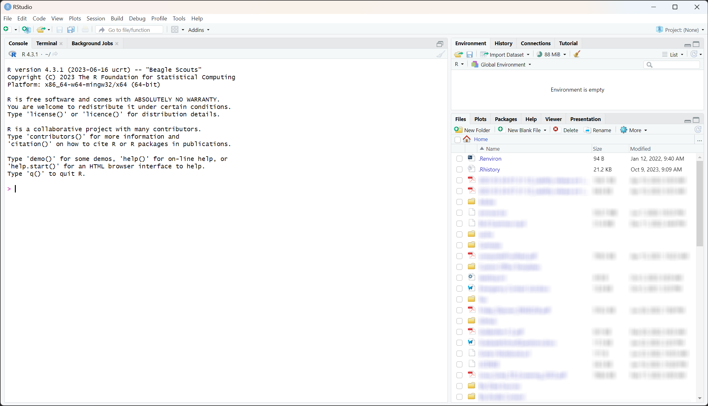

```{r, message = FALSE, warning = FALSE, echo = FALSE}
knitr::opts_chunk$set(tidy = TRUE, 
                      fig.align="center", 
                      tidy.opts = list(width.cutoff = 80),
                      error=TRUE)
```

## About Python, R, and RStudio Briefly

`Python` is a popular programming language commonly used for statistical analysis,
data visualization, and machine learning. The many ways to interact with
`Python` are called Integrated Development Environments (IDE's). IDE choice depends on 
the context, the nature of the project, and/or personal preference, among other 
factors. Here are a few IDE's for interacting with `Python`.

- IDLE (Python's Integrated Development and Learning)
- PyCharm
- Jupyter Notebook
- Visual Studio Code
- Google Colab
- RStudio

Additionally, `Python` has broad applications beyond data analysis and can be used
for web development, automation, and more. Ultimately, the choice between `R` and 
`Python` will depend on your specific needs and preferences. Since this series of workshops 
were developed in `RStudio` and `RStudio` uses `R` behind the scenes, both need to 
be installed on your computer if you decide to use `RStudio` as your IDE of choice. 
Otherwise the any code in a `Python` *chunk* will work in any `Python` IDE.
Both `R` and `RStudio` are cross-platform, so that everyone's versions look and 
operate the same regardless of their operating system! 

For more details on the installation of `R` and `RStudio`, you have hopefully 
completed the steps discussed here \href{https://greenwood-stat.shinyapps.io/InstallDemo_RWorkshops/}. 
The short version for downloading is to first go to \href{https://cloud.r-project.org/} 
to `R` installed and then go to \href{https://rstudio.com/products/rstudio/download/} to install RStudio.

If you did not complete that or do not have a computer available, you can also borrow
a laptop from the MSU library (or maybe from a good friend) for the workshop. It needs 
to be a computer that is running Linux, Windows, or a somewhat recent macOS. Unfortunately,
a Chromebook or iPad are not sufficient for installing and running R.

### Prepare for the Workshop

Please take these steps if you haven't already done so:

1. Install `R`
2. Install RStudio
3. Download the ZIP file provided for the workshop
4. ***Unzip the file and save the contents locally***
5. Open RStudio
6. Install reticulate
7. Run the code to install miniconda
8. Install python packages

When you open RStudio for the first time, if you have not previously used it or attended 
the **Introduction to R** workshop, you will see three panels.

  

The next thing you need to do is navigate to the unzipped folder and open the RMD file.

Go to **File > Open File...** and browse to where you unzipped the folder and select the **RMD** file.

Once you do that your window should look like this:

  

Most of you should see a yellow bar saying 
***Package reticulate required but is not installed."*** with options 
***Install*** or ***Don't Show Again***, if you haven't already installed this
package.

`>>> CLICK ON Install NOW! <<<`

### RStudio Orientation and Layout

However you get to it, RStudio has four possible panels, where each can be viewed at the same time and has multiple tabs available.  

- the __Editor__ for your scripts and documents (top-left)  
- the `R` __Console__ (bottom-left)  
- your __Environment (Objects/Variables)/History__ (top-right)  
- and your __Files/Plots/Packages/Help/Viewer__ (bottom-right).

  

The next step is to set up the system to install Python and load in Python packages:

```{r}
#Only need to run the following once:
reticulate::install_miniconda()
library(reticulate) # Integrates Python with R
py_install(packages=c("pandas", "scipy", "numpy","matplotlib"))
```

Lastly, we need to make sure that RStudio knows about your Python Interpreter.

Go to **Tools > Global Options...**. You should see a dialog box like the one
below, and notice **Python** in the list on the left. 

  
Click on **Python**, and make sure that you select a python interpreter if one
is not already selected for you.

  


## Working in `RStudio`  

The document we provided for you is an Rmarkdown (.Rmd) document. It allows you 
to work in a reproducible fashion, with both code (placed in what are called code 
chunks) and descriptions of results in the same file. The grey sections that have 
three single quotes then `{r}` will delineate a code chunk. 

````
```{r}`r ''`
1 + 1
```  
````
The `{r}` specifies which language you will be using, so since we will be working
with `Python` we set our chunks as follows:

````
```{python}`python ''`
1 + 1
```  
````

Type all of your code in these code chunks and other documentation and 
interpretation of results outside of the code chunks (like we are doing here). 
Although there are more complex ways to work in RStudio, you should start today 
with saving this .Rmd  file into a folder that also contains any data and other 
figures you might want to read into this document. When you do that, RStudio will 
know where to look to read in the data so you do not need to know the path for 
its physical location on your computer. Once we are done with our local work, we 
can also use the `Knit` button to compile our work into HTML, Word (DOCX), or 
PDF documents. We will demonstrate this at the end of the workshop - but this 
will only work if all the code "runs" and what we have provided you has some 
errors in it. One other great (and fairly new) feature in these files is that it 
does live spell-checknig - I mean spell-checking - by underlining suspect words. 
We will also discuss RStudio "Projects" that take this one step further in terms 
of organizing your work built around this markdown framework. It is important to 
understand the various ways to do your work in R using RStudio. 

`RStudio` recognizes where the variable lives, that is under what environment 
you can find it stored in the Environment panel, you can click the drop down tab 
`R` where you will see the different environment options. Similarly for the Console,
the compiler will be determined by the type of chunk you defined. 


***Example:***
In `R`:

```{r}
library(reticulate) # Integrates Python with R
x = 2
y = 3
z = x + y 
```

In `Python`:

```{python}
x = 3
y = 2
z = x + y 
```

And notice in your different environments that variables are not overwritten as 
`RStudio` recognizes the corresponding environment. Also, notice that in your `Python`
environment the resulting output is stored in an `R` interface object called Data. 
This is because RStudio uses the `reticulate` package to integrate `Python` with `R`, 
and this package automatically creates an `R` interface object to store the output 
from `Python`.

If `R` is ready to accept commands, the `R` console (in the bottom-left) will 
show a `>` prompt (`>>>` in `Python` environment). When `R` receives a command 
(by typing, copy-pasting, or using the shortcut), it will execute it, and when 
finished will display the results and show the `>` symbol (or `>>>`) once again. 
If `R` is still waiting for you to  provide it with additional instructions, a `+` 
($\cdots$ in `Python` environment) will appear in the console. This should tell you 
that you didn't finish your command. You could have forgotten to close your 
parenthesis or a quotation. If this happens and you are unsure of what went wrong, 
click inside the console and hit the `Esc` key. Then you can start over and figure
out where you went wrong!

### Calculator  

__Practice__: Enter each of the following commands and confirm that the response
is the correct answer.  Try to do this in the console and by executing the code in the code chunk, both line by line and all at once.

```{python}  
1 + 2 

16 * 9

20 / 5

18.5 - 7.21

2 ^ 2
```

Notice how `2^2`$\neq$ (is not equal to) `4`! In `Python` the exponent operator 
is not the expected _caret_ `^` symbol, but rather exponentiation is defined by 
_double star_ `**`:

```{python}

2 ** 2

```

Also notice algebraic operations are not space-sensitive, this is helpful when trying
to format, and read code in `Python`. 

Like `R`, `Python` has a wide range of libraries
and packages (often referred as `Modules`) that make it a powerful tool for data 
analysis. To install and import Python modules in RStudio:

1.- Install the `reticulate` package: The `reticulate` package is a package that 
provides a way to use `Python` within `RStudio`. You can install it by running 
the following command in the `R` console:

````
install.packages("reticulate")

````

```{r}
install.packages("reticulate")
```

2.- Install the required `Python` packages: You can install `Python` packages 
using the `pip` command in the `Python` console within `RStudio`. For example,
if you want to install the `pandas` package (more on this later), you can run
the following command:

````
```{r}`r ''`

library(reticulate)
py_install("pandas")

```
````

```{r}
library(reticulate)
py_install("pandas")
```


Where `py_install()` is an `R` function provided by the `reticulate` package, 
which allows you to install `Python` packages from within `R`.

3.- Once the package is installed, you can import it in a `Python` chunk using the 
`import()` function. For example:

````
```{python}`python ''`

import pandas as pd

```  
````

```{python}
import pandas as pd
```

This will import the pandas package and give it an alias `pd`, which you can use
to access its functions and objects. Aliases are useful because they are fewer
characters to type as you have to use either the package name or alias anytime
you call a function. ***So choose your alias wisely!***

4.- Note that the `reticulate` package requires a `Python` installation to be
available on your system, and it uses the `use_python()` function to specify the
path to the `Python` binary. You can use `use_python()` to specify a specific 
`Python` version or environment, or you can let `reticulate` automatically 
locate a suitable `Python` installation. For example:

````
```{r}`r ''`

library(reticulate)
use_python("/usr/bin/python3")

```
````

If you have problems getting Python installed, it may be because you had a
previous installation. We recommend that if you are having issues, to uninstall
Python and reinstall by following the steps listed above.

Now that we know how to import and load `Python` modules, let us work with some 
examples of commonly used modules, such as the `math` module. The math module is
a built-in module in `Python` that provides various mathematical functions and 
constants such as the square root, trigonometric, logarithmic, and exponential 
functions. The general syntax for `Python` when calling a function from a specific
module is `module.attribute`.

Try the following code:

```{python}

import math
math.sqrt(2)

math.cos(math.pi)

math.factorial(4)

math.cos(math.pi/4) ** 2 + math.sin(math.pi/4) ** 2

```

## Creating Objects 

These operations, however, are not very interesting. To do more useful things in
`Python`, we need to assign values to an object. To create an object, we tell `RStudio` the
object's name, followed by an equal sign (`=`), and finally the value of 
the object. This would look something like this:

`x = 6`

Once we execute/run this line of code, we notice that a new object appears in 
our (`Python`) environment window. This window shows all of the objects that you have 
created during your session. The value of `x` appears next to it, since it 
is a scalar. 

__Remarks:__  

* If you are familiar with `R` language you might think of using the assignment
arrow `<-` instead of `=`, however, in `Python` this is not a proper syntax.

    + `Python` is case sensitive, so if you name your variable `cat` but then try to
    run the code `Cat + 2`, you will get an error saying that `Cat` does not exist.
    + You also want your object's name to be explanatory, but not too long. 
    Think `current_temperature` verses `current_temp`. Do you really want to 
    type out temperature every time?  
    + Finally, you cannot begin any object's name with a number. You can end a 
    name with a number (e.g. clean_data2), but does that give you much 
    information about what is in the contents of `clean_data2` relative to 
    `clean_data`?   
    + The name cannot contain any punctuation symbols, except for `.` and `_` 
    (`.` is not recommended)  
    + You should not name your object the same as any common functions you may 
    use (`mean`, `stdev,` etc.)
      
* Using a consistent coding style makes your code clearer to read for your 
future self and your collaborators. 

### Clean Code 

Yes, writing code may be completely new to you, but there is a difference between
code that looks nice and code that does not. Generally, object names should be 
nouns and function names should be verbs. It is also important that your code 
looks presentable, so that a friend/college/professor can read it and understand
what you are doing. For these reasons, there are style guides for writing code 
in `R`. The two main style guides are Google's 
\href{https://google.github.io/styleguide/pyguide.html}{(link)} and PEP 8, the 
official Python style guide, maintained by the Python Software Foundation: 
\href{https://peps.python.org/pep-0008/}{(link)} Optionally, you can install 
`pylint` to automatically check and correct for issues in your code styling. 
More on packages to come!

## Working with Objects 

When you assign a value to an object (like we did previously) `Python` does not
output anything by default. If you want to see the output you can use the command 
`print(value)`, then `Python` will output the value of the object you created. 

```{python}

x = 6

print(x)

```

Once the object has been created, you can use it! Run the following lines of code:

```{python}

2.2 * x

4 + x

```

We can also overwrite an object's value, so that it has a new value. In the code
below create a new object `y` and then we give `x` a new value of 2. 

```{python}

y = x + 6

x = 2

```

**Exercise 1:** What is the current value of `y`? 12 or 8?  

```{python}
#Exercise 1 code here!

print(y)

# or

y
```

## Working with Different Data Types 

A vector in `Python`, formally a `list` or a `NumPy` array is the basic data type 
in `Python`. A vector is a series of values, which can be either numbers or characters, 
but every entry of the vector must be the same data type. `Python` can tell that
you are building a vector when you use the squared brackets separating each element 
with a comma `[a,b,...,c]`, `list()` or `numpy.array([])` functions, which concatenates 
a series of entries together. 

Install the `Numpy` module in `Python` command window using the syntax `!pip install`
(this may take a few moments):

````
!pip install numpy
````
__Remarks:__
*When you include `!` at the beginning of a command in a `Python` script, `RStudio`
will treat it as a shell command rather than a Python command.

    + A shell command is a command that is executed in a command-line interface 
    (CLI) or shell, which is a text-based user interface for interacting with an
    operating system or software application.
    + In a shell environment, you can type commands and execute them by pressing 
    the Enter key.
    + The shell interprets the command and executes it, displaying the output
    in the console or terminal window.


```{python}

import numpy as np

temps_list = [50, 55, 60, 65]
temps_list

temps_numpy = np.array([50, 55, 60, 65])
print(temps_numpy)

```

To make a vector of characters, you are required to use quotation marks `" "` to 
indicate to `Python` that the value you are using is not an object you already 
created in `Python`.

```{python}

animals_list = ["cat", "dog", "bird", "fish"]
animals_list

animals_numpy = np.array(["cat", "dog", "bird", "fish"])
print(animals_numpy)

```

Important features of a vector is the type of data they store. Run the following
lines of code and decide what type of data the vectors contain. 

```{python}

type(temps_list)

type(temps_numpy)

```

__Remarks:__

* `numpy.ndarray` is a `Python` class  that represents an n-dimensional array or a 
multi-dimensional array. An array is a data structure that stores a collection 
of values of the same type.

* `list` is a `Python` class type that represents a list data structure in Python. 
A list is an ordered collection of objects or values, enclosed in square brackets 
and separated by commas. A list can contain objects of different data types, 
such as integers, floats, strings, or even other lists.


**Exercise 2:** Create a vector, named `dec`, that contains decimal valued numbers. Then check
what data type that vector contains?

```{python}

dec = np.array([1.2, 3.4, 5.6])
print(dec)
print(type(dec))

# Alternatively
dec_list = [1.2, 3.4, 5.6]
dec_list
print(type(dec_list))

```

Another possible data type are dictionaries. In `Python`, a dictionary is an 
unordered collection of key-value pairs. It is represented by a pair of curly braces 
`{}`, with each key-value pair separated by a colon `:`. _Also known as associative_ 
_arrays, maps, or hash tables in other programming languages_. 

```{python}

translate = {'Hello':'Hola', 'How are you?':'Como estas?', 'Fibula':'Perone'}
translate['Fibula']
```

So in `Python`, vectors (lists, numpy arrays) and dictionaries are data 
structures that allow you to store collections of values, but they have some key 
differences:

1.- Vectors are ordered while Dictionaries are not.

2.- Vectors are indexed by integer positions while Dictionaries are indexed by keys.

3.- All elements in a vector are of the same type, while in Dictionaries this need
    not be the case.
    
4.- You can "mutate" (change) the values contained in a vector or dictionary, BUT 
    you cannot change the keys in a dictionary once they are assigned, i.e., they
    are "immutable".
    

```{python}

# Creating a vector
vec = [1, 2, 3, 4]

# Accessing values in a vector by index
print(vec[0])  # Output: 1


# Modifying a value in a vector
vec[0] = 5
print(vec[0])

# Creating a dictionary
translate = {'Hello':'Hola', 'How are you?':'Como estas?', 'Fibula':'Perone'}

# Accessing values in a dictionary by key
print(translate['How are you?'])  # Output: 3

# Adding a new key-value pair to a dictionary
translate['I like cheese'] = 'Me gusta el queso'
print(translate['I like cheese'])

# Modifying a value in a dictionary
translate['Hello'] = 'Adios'
print(translate['Hello'])

print(translate)


```

Another possible data type is a logical (Boolean) value. This type of data  
takes on values of `True` and `False`(*WARNING* `Python` is case sensitive so
`TRUE`, `FALSE` won't work). But, we said that vectors could only be 
numbers or characters. If `TRUE` and `FALSE` don't have quotations around them,
then they aren't characters. So, then they must be numbers. What numbers do you 
think they are?  

```{python}

logic = [True, False, False, True]

type(logic)

```

Notice that the `type()` command is telling us what we already know, it's a list! 
But is we are interested in knowing the type of each element in a list one can 
perform a for loop, but if we know that all elements of a list are of the same type
then we can just look at the type of any element in that list:

```{python}

type(logic[0])

```

```{python}

diff_types = [False, "Space", 2]
for i in diff_types:
  print(type(i))

```

Another instance of a data type in `Python` is called a *tuple* which is 
an ordered, immutable collection of elements. Like lists, tuples can 
contain elements of different data types, including numbers, strings, and other 
objects. However, unlike lists, *tuples cannot be modified once they are created*.
This means that you cannot add, remove, or modify elements in a tuple after it has
been defined. *Tuples are defined using parentheses*, and elements are separated 
by commas:

```{python}

tuple_ex = (1, 'apple', True)

```

What do you think the output of the following code will be?


```{python}
tuple_ex[0] = 4
```


**Exercise 3:** What happens when we try to mix different data types into one 
vector? Speculate what will happen when we run each of the following lines of code:

```{python}

num_char = [1, 2, 3, "a"]

# for i in num_char:
#   print(type(i))

num_logic = [1, 2, 3, False]

#type(num_logic)
# for i in num_logic:
#   print(type(i))

char_logic = ["a", "b", "c", True]

guess = [1, 2, 3, "4"]

```

In each of these vectors, the two types of data were *coerced* into a single 
data type. This happens in a hierarchy, where some data types get preference 
over others. Can we draw a diagram of the hierarchy?  
#Not include in reviewed:

__Answer:__

The hierarchy of types in `Python` is as 
follows, using $>$ to represent the order: 
`type > int > float > bool > str > list > tuple > set > dict >`$\cdots$

__Remarks:__

*In `Python` an `R` list is equivalent to a dictionary.
*In `R` a `Python` list is equivalent to vector.

What about a list of lists in `Python'?

```{python}

OS = ["Mac", "Windows", "Linux"]
fav_nums = [12, 13, 17]
logic = [True, False, False]

layered_list = [OS, fav_nums, logic]
layered_list[1]

layered_list[0][1]


```

So to access the elements of list within a list we use the syntax `list[list_i][element]`.

__Remarks:__

* We have been outputting values with `print()` and by just running the name of 
the variable, why can we do this?

    + When running code in a Jupyter notebook or in an interactive Python shell 
    (such as `RStudio`), you can simply type the name of a variable or expression 
    to see its value printed. This is because the notebook automatically displays 
    the output of any expression that is executed without explicitly requiring 
    the use of `print()`.
    
    + When running a Python script from the command line or in an IDE, you must
    use print() to display output. If you don't use `print()`, the output will 
    not be displayed.

### Named Lists

To create a named list in `Python`, you can use a dictionary:

```{python}

my_named_list = {'title': 'statistics', 'numbers': list(range(1, 11)), 
'data': True}
print(my_named_list)

```

## Importing Data  

* Use the __Import Dataset__ button in the __Environment__ tab  
* Choose the __From Text (base)__ option  
* Click on the __Browse__ button  
* Direct the computer to where you saved the `BlackfootFish.csv` data file, click __open__  
* It will bring up a preview of the data 
* Make sure that the box labeled "Strings as factors" is not checked 
* Click on the __Import__ button  

Notice the code that outputs in the console (the bottom left square). This is 
the code that you could have typed in the code chunk below to import the data 
yourself. Copy and paste the code that was output in the code chunk below. 

Recall the module `pandas` mentioned earlier? `pandas` is a popular `Python` 
library used for data manipulation and analysis. It provides data structures 
for efficiently storing and manipulating large, structured data sets and 
includes functions for data cleaning, merging, filtering, and appending.

If you haven't already, install the `pandas` module:

````
```{python}`python''`

!pip install pandas

```
````

```{python}
#!pip install pandas
import pandas as pd
BlackfootFish = pd.read_csv('BlackfootFish.csv')

```

The path provided can also be simplified to just include the file name - if the 
.Rmd and data are saved in the same folder. If you have any trouble reading in the
data set, here is code that allows you to read the data from our github repository:


```{python}

BlackfootFish = pd.read_csv("https://github.com/saramannheimer/data-science-r\
-workshops/raw/master/Introduction%20to%20R/AY%202020-2021/Student%20Version/\
BlackfootFish.csv")

```


## Structure of Data  

The data we will use is organized into data tables. When you imported the 
BlackfootFish data into `RStudio` it was saved as an object. You are able to inspect
the structure of the BlackfootFish object using functions built in to `Python` 
(no packages necessary).  

Run the following code. What is output from each of the following commands?


```{python}

print(type(BlackfootFish)) # Class of the object

print(BlackfootFish.shape) # Number of rows and columns

print(BlackfootFish.columns) # Column names

print(BlackfootFish.dtypes) # Data types of each column and the first few rows of data


```

```{python}

BlackfootFish.describe()

type(BlackfootFish)

```

When we inspect dataframes, or other objects in `Python`, there are some general 
functions that are useful to check the content/structure of the data. 
Here are some (assuming you are importing data using `pandas`):

- size:
    + `datasetname.shape` : rows and columns 
    + If your data set is a pandas dataframe `datasetname.shape[0]`: number of rows,
    + If your data set is a pandas dataframe `datasetname.shape[1]`: number of columns.
    + If your data set is a pandas dataframe and variable is a column in the
    dataframe: `len(datasetname['variable'])`: number of columns.
    
- content:
    + `datasetname.head()`: first 5 rows.
    + `datasetname.tail()`: last 5 rows.
    
- names:
    + `colnames(datasetname)`: column names.
    + `datasetname.index`: row names.
    
- summary of content:
    + `datasetname.info()`: structure of object and information about the columns.
    + `datasetname.describe()`: summary statistics for each column.
    
## Dataframes 

What is a dataframe? A dataframe is a two-dimensional table-like data structure, 
similar to a spreadsheet. It is a primary data structure provided 
by the pandas library. You can create a dataframe in several ways, such as loading
data from a CSV, Excel file, SQL database, or by constructing it from scratch using
`Python` lists or dictionaries. A dataframe is made up of columns, where each column 
is a series object. Each column can have a different data type, but all the values 
in a column must have the same data type.


## Extracting Data  

In `Python`, you can access a specific column of a dataframe using square bracket
notation `[]` with the column name inside the brackets. 
What do you think the following code will output?
    

```{python}
df = pd.read_csv('BlackfootFish.csv')

# Access the 'weight' column
weight_col = df['weight']

print(weight_col)
```


#Remove afer review: This will print the weight column as a Pandas Series

```{python}

years = BlackfootFish['year']
# extracts year from the dataset and saves it into a new variable named years
years.head

years_str = str(years)
print(years_str)

## How would you determine how long the vector is?

```

Another method for accessing data in the dataset is using the `pandas` function
`iloc[]`. If you look to your right in the __Environment__ window, you 
notice that RStudio tells you the dimensions of the BlackfootFish data. You can 
(roughly) view the dataset as a matrix of entries, with variable names for each 
of the columns. I could instead use `iloc` function to perform the same task as
above, using the following code,

```{python}

# Extract the values in the fifth column and store them in a variable called "years"
years = BlackfootFish.iloc[:, 4].values

```

### Practice:

The following is a preview of the dataframe `df`: 


```{python}

df = pd.DataFrame({
  'x': ["H", "N", "T", "W", "V"],
  'y': ["May", "Oct", "Mar", "Aug", "Feb"],
  'z': [2010, 2015, 2018, 2017, 2019]
})

df

```
**Exercise 4:** What would be output if you entered: `df.iloc[2, :]`? 

```{python}
#Remove for participants.
df.iloc[2, :]

```

**Exercise 5:** What would you input to get an output of `2015`? Can you 
think of two ways to do it?

```{python}

df.iloc[1,:]

df.loc[df['y'] == 'Oct', 'z'].item()

# a third way
df["z"][1] # select first 2nd row of "z" column

```

__Remarks:__

* Notice the difference between `loc` and `iloc`. Both are indexing methods in `pandas`
that allow for selection of data from a data frame, how do they differ?

    + `iloc` selects data based on the integer index of the rows and columns, with
    syntax `df.iloc[row_index, column_index]`.
    + `loc` selects data base on the row and column labels, with syntax
    `df.loc[row_label, colum_label]`.
    + *WARNING* `iloc` is exclusive of the end index, `loc` is inclusive.
    + `iloc` does not support Boolean indexing, `loc` does.

### Accessing Data

When we have a data frame or a list of objects, we can extract specific items by 
specifying their position in the data frame or list. We saw how to do this with 
a single item, row, or column that we want to extract (`df.iloc[1, 5]`, 
`df.iloc[3,]` or `df.iloc[, 5]`). We can specify two items, rows, or columns by 
either using the fact that the two things we want are adjacent, or we can 
combine what we want into a list that we can then use for extracting. We will 
continue to use the indices to specify what we want to extract.

Python uses zero-based indexing, which means you have to shift your start and
stop indices, they might not be exactly as you would intuitively expect. The 
images below came from datacarpentry.org 
(https://datacarpentry.org/python-ecology-lesson/03-index-slice-subset.html).


For example, `[0]` or `0:1` could identify the first object in a list, and
`[0, 1]` could identify the first two objects in a list. However 
they are adjacent so we could use `a:b+1` to indicate that we want everything from 
position `a` to position `b` in the list. So, `[1,3]` would give the same items 
as `1:3`.

#### Quick Check

Run the following code to see what you get. Play around with the first and last numbers to see what happens.

```{python}
list([1,2,3,4,5])
list(range(1,6))
list(range(6,1,-1))
list(range(123,131))
list(range(3,-1,-1))

list([1,2,3,4,5])[1:3]
list(range(123,131))[3:6]
list(range(6,1,-1))[2:4]
```

When you want adjacent items, using the `a:b` notation is nicer than having to type out all of the values.

***What about non-adjacent items?***

For non-adjacent items, you just need to fall back on listing everything out. Say you want the first, third, and 9th item in a list. Then you can use `[1, 3, 9]`.

Now that we've talked about how to create lists of the indices we want, how do we use these lists to extract items?

Using our data frame that we created above, to extract rows 1 and 2 we can use the notation `[1,2]` (or `1:3` since they are adjacent).

```{python}
df.iloc[[1,2],]
df.iloc[1:3, ]
```

If we want to extract rows 1 and 3, we can use this list of indices: `[1, 3]`

```{python}
df.iloc[[1,3],]
```

***NOTE:*** Instead of using indices you can also do the same technique with names if the rows or columns are named.

**Exercise 6:** How would you pull off only columns `x` and `y`? What about 
pulling off only columns `x` and `z`?

```{python}

df.iloc[:, [0,1]]

df.loc[:, ['x','z']]

```

**Exercise 7:** How would you modify the script below, to get an output 
of `22 24`? 

```{python}

s = [22, 24, 49, 18, 1, 6]
s

s[2]

```

```{python}
# Remove for participants.
# This will select the first two elements of the list 
s[:2]

# This will select the elements at index positions 0 and 1 from the element at
# index 0 up to (but not including) the element at index 2
s[0:2]
```

**Exercise 8:** What would be output if you entered: `s[2, ]`? 

```{python}

```


## Changing Data Type  

In `Python`, when building or importing a dataframe, character columns are usually
represented as strings (i.e., text) by default. 
**Unlike in R, there is no factor data type in Python**.
In `Python` you can use the `Pandas` library, which provides functions like `read_csv()`
and `read_table()` to import data from CSV. `Pandas` does not convert string columns 
to any other data type, but it does infer the data type of each column.

If you want to explicitly set the data type of a column or keep a string column 
as a string, you can use the dtype parameter in `read_csv()` to specify the data
type for each column:


```{python}
import pandas as np
df = pd.read_csv('BlackfootFish.csv', dtype = {'column':str})
```


__Remarks:__

* If you are familiar with `R` note that there is no equivalent `stringAsFactors`
argument in `read_csv()` from `pandas`.

If you want to determine the unique elements in a column of a dataframe in `Python`,
you can use the `unique()` method of `pandas`:

```{python}

BlackfootFish['species'].unique()

BlackfootFish['species'].unique

```

What are the difference in outputs? Using `unique()` the output is an array of the
unique values in the `species` column of BlackfootFish. If we leave out the 
parenthesis, i.e., `unique` the output will be the details of the dataframe, including
data type, and its length, so no unique values. The key difference is that `unique()`
is a **method** from the `pandas` library, that is, some sort of function. On other
hand `unique` is an **attribute** (if it exists) of the object.

**Exercise 9:**  Year was saved as an integer data type (1989 - 2006), but we 
may want to consider it to be a categorical variable (a factor). Write the `Python` 
code to create a new variable called `yearF` and then check the unique categories
for this new variable.

```{python}

BlackfootFish['yearF'] = BlackfootFish['year'].astype('category')
### Write code to check the unique categories of yearF:

```

Alternatively, 


```{python}
BlackfootFish['yearF'] = pd.Categorical(BlackfootFish['year'])
BlackfootFish['yearF'].unique()
BlackfootFish['yearF'].unique

```


**Exercise 10:** Now, verify that `yearF` is viewed as a categorical variable, 
with the same levels as `year`. (hint: you have already used functions 
that would do this for you) 

```{python}

print(BlackfootFish.dtypes)

```

## Packages  

As we mentioned previously, `Python` has many packages, which people around the world
work on to provide and maintain new software and new capabilities for `Python`. We 
have already shown some examples like `panda`, `numpy`, and `math` and how to load 
them, we give a formal description now. You will slowly accumulate a number of packages
that you use often for a variety of purposes. In order to use the elements 
(data, functions) of the packages, you have to first install the package 
(only once on a given computer) and then load the package (every time). If you are 
working with `RStudio` as an IDE for `Python` then you must make sure to have the 
package `reticulate` installed and loaded into `R`:

In an `R` chunk:
````
```{r}`r ''`
install.packages("reticulate")
library(reticulate)
```
````
Now you can install any `Python` library as illustrated with the following example:


```{python echo=TRUE, eval=FALSE}
#Install statsmodels
!pip install scipy
!pip install numpy
```

```{python}
from scipy import stats as stats
import numpy as np

# generate random numbers from a normal distribution
mu, sigma = 0, 1
samples = stats.norm.rvs(loc=mu, scale=sigma, size=1000)

# compute summary statistics
mean = np.mean(samples)
std = np.std(samples)

print(f'The mean is {mean} and the standard deviation is {std}')

```

Here we have installed the package/module `scipy.stats` which provides a wide
range of probability distributions. The module includes functions for working with
both continuous and discrete distributions. The general syntax is `stats.distribution`,
in the above example `stats.norm.rvs(loc, scale, size)` generates a sample 
of size = n of random numbers from a normal distribution where `loc` (location) specifies
the mean of the distribution, and `scale` specifies the standard deviation.

Moreover, notice that we made use of the `numpy` module, as it contains functions
such as `mean` and `std` that can be applied to Numpy arrays. Finally we print out
the output.

__Additional Comments:__ For printing the output we used a `Python` `f-string`
which is used to print a sentence along with a calculated value of a variable, with
syntax `print(f'The result is {variable}')`.

## Finding Help 

`Python` has a great collection of packages and documentation, making it a popular 
choice for data science and scientific computing. Some of the most commonly used
modules for statistical analysis, machine learning, data visualization, and much more
are `NumPy`, `Pandas`, `SciPy`, `scikit-learn`, `Matplotlib`, among others.
If you need a function to complete a task (say find the variance), but are not quite
sure how it's spelled, what arguments it takes, or what package it lives in, don't fret!
`Python` has a built-in `help()` function used to get information about `Python` 
functions, modules, and classes.  

Another great resource for finding help is *Stack Overflow* Python's community,
which is a good place to start as a beginner to learn and use `Python`.

## Functions  

In `Python` there are both functions that are built in (require no package to be 
loaded), as well as functions that are housed within specific packages. You have
already used a few built in functions to inspect the structure of the 
BlackfootFish data (`print`, `type`, `describe`). 

As you may know, a function 
transforms an input (potentially multiple) into an output. You have to provide
`Python` with the inputs (arguments) required for the function to generate an output.
The argument(s) inside a function happen after the `(` symbol. 
One way to identify that an 
object is a function when it is immediately followed by a  `(` and the 
corresponding closing `)` comes after the arguments are complete.
The output of a function does not have to be numerical and it typically is 
not a single number, it can be a set of things or a dataset.   

<!-- You can also define your own functions in `Python`.  You have -->
<!-- already used a few built in functions to inspect the structure of the  -->
<!-- BlackfootFish data (`print`, `type`, `describe`). As we know, a function  -->
<!-- transforms an input (potentially multiple) into an output. You have to tell -->
<!-- `Python` you are defining a function by starting with `def` and then followed by -->
<!-- the name of you function`def function` with the inputs (arguments) required for  -->
<!-- the function to generate an output.The argument(s) inside a function happen inside  -->
<!-- the `(` symbol and the corresponding closing `)`. Finally you must tell `Python` -->
<!-- the "rules" of your function after defining your function with `:`. -->

Suppose we wanted to create a vector of 10 zeros. To do this, we would use the 
`np.array` function:

```{python}

import numpy as np
# repeating 0 ten times
np.array([0] * 10 )
[0] * 10

# switching order of arguments
np.array(10 * [0])
10 * [0]

```

Now let's look over some other functions that are often used: 

```{python}
# takes a numerical input, but there are NA's in our data
np.mean(BlackfootFish['weight'])

# notice Python ignores NAs automatically.
np.mean(BlackfootFish['weight'].dropna())

# gives an error because the input is not the correct data type 
# np.median(BlackfootFish['species'])


np.corrcoef(BlackfootFish['length'], BlackfootFish['weight'])

# Does corrcoef have an option to remove NA's? No, np.corrcoef does not have an option
# to remove NA's, you must deal with missing values before calling the function.

```


One way to remove the missing values and then compute the correlation coefficient is:

```{python}

valid_mask = ~np.isnan(BlackfootFish['length']) & ~np.isnan(BlackfootFish['weight'])
length_valid = BlackfootFish['length'][valid_mask]
weight_valid = BlackfootFish['weight'][valid_mask]

corr_coeff = np.corrcoef(length_valid, weight_valid)[0,1]

print(f"The correlation coefficient is: {corr_coeff}")

```

Let's break it down line by line:

 - Line 1: `np.isnan()` finds the data points that have missing values in the data.
            `~` is a logical operator that inverts/negates, so `~np.isnan()` will
            return `True` for all data points with no NA's. Now this will create
            a "mask" which is a logical (boolean) array. The symbol `&` will combine 
            the two masks into one.
 - Line 2 and 3: We use the index of `valid_mask` to create `length` and `weight` variables
                 with no missing values.
 - Line 4: `np.corrcoef()` returns a correlation matrix where the (0,0) entry is the
            correlation coefficient between the first array with itself. The entry (1,1)
            is the correlation coefficient between the second array with itself.
            The entries (0,1)=(1,0) are the correlation coefficient between both
            arrays, hence the `[0,1]`.
 - Line 5: We then use an `f-string` to print the output in a nice way.
 
 As seen in the functions above, some functions have *optional* arguments. If 
they are not specified by the user, then they take on their default value 
(`True` for `dropna`). These options control the behavior of the functions, 
such as whether it includes/excludes NA values. 
         
            
## Cleaning Data  

In many instances, you will deal with data that are not "clean". Based on the 
output we received from the `np.mean()` function, we know that there are NA's in 
the BlackfootFish data, possibly across a variety of variables. Before we used 
`dropna` as an option to remove NA's *within* a function. We can use the same 
command on the entire data frame before applying any functions to it. Based on the
output below, how many rows in the BlackfootFish data have an NA present?  

```{python}
            
BlackfootFish.shape # gives the dimensions of the dataset in (row, column) format  

BlackfootFish.dropna().shape
# .dropna() is method in Pandas which removes missing values (NaN).

```

__Remark:__ The computer is using an algorithm to return a dataset with no NA 
values anywhere in it. This algorithm goes through every row of the dataset and
(roughly) has the following steps, 

* Inspect each row or column to check for missing values (an alternative to 
  `dropna` is the `isnull` method).
* If a row or column contains NaN's, it is dropped (removed) from the data frame.
* Once it has stepped through every row, the function outputs the "cleaned" 
  dataframe
  
If we wish to remove all of the NA's from the dataset, we can use the 
`dropna` command from above. We can save the new "clean" dataset under a new name
(creating a new object) or under the same name as before (replacing the old 
object with the new object).


```{python}
BlackfootFish_clean = BlackfootFish.dropna()
# Creates a new dataframe, where the NA's have all been removed 
```


## Data Visualization  

There are many different genres of data graphics, with many different variations
on each genre. Here are some commonly encountered kinds:  

* __scatterplots__: showing relationships between two quantitative variables    
* __distributions__: showing distributions of a single quantitative variable      
* __bar charts__: displaying frequencies or densities of a single categorical 
  variable  

### Scatterplots

The main purpose of the scatterplot is to show the relationship between two 
variables across several or many cases. Most often, there is a Cartesian 
coordinate system in which the x-axis represents one variable and the y-axis the
second variable.  

```{python echo=TRUE, eval=FALSE}
!pip install matplotlib
```

```{python}
import matplotlib.pyplot as plt

plt.scatter(BlackfootFish_clean['weight'], BlackfootFish_clean['length'])
plt.show()

```


```{python}
import matplotlib.pyplot as plt
fig, ax = plt.subplots() # creates a new figure and an axes object to plot data on
ax.scatter(BlackfootFish_clean['weight'], BlackfootFish_clean['length'])
ax.set_xlabel('Weight (gm)') # adding in axis labels
ax.set_ylabel('Length (cm)')
ax.set_yticklabels(ax.get_yticks(), rotation = 90) # changing orientation of 
                                                    #y-axis labels
ax.set_title('Plot of Length by Weight of ...') # adds a title                                                    
plt.show()
```

Let's breakdown the following line `ax.set_yticklables(ax..get_yticks(), rotation = 90)`:

 - `ax` is for `Axes` which is an object in `Matplotlib`, representing, you guessed it,
    the plot's axes.
 - `ax.set_yticklabels()` is a method of `Axes` class, which set the labels for the
    y-axis "ticks".
 - `ax.get_yticks()` returns the locations of the y-axis ticks.
 - `rotation = 90` is self explanatory.
 - `set_yticklabels()` specifies the angle (in degrees) by which the axis is rotated.

### Distribution

A histogram shows how many observations fall into a given range of values of a 
variable and can be used to visualize the distribution of a single quantitative variable.

By default, Matplotlib will use the current figure and axes to plot any new data, 
unless you explicitly create a new figure and axes object.

```{python}

fig, ax_hist = plt.subplots()
ax_hist.hist(BlackfootFish_clean['length']);
plt.show()

```


```{python}

fig, ax_hist = plt.subplots()
# converts to a density plot (area adds to 1)
ax_hist.hist(BlackfootFish_clean['length'], density=True);
# adds x-axis label 
ax_hist.set_xlabel('Length (cm)')
ax_hist.set_ylabel('Frequency')
# adds title to plot
ax_hist.set_title('Fish Lengths in Blackfoot River')
plt.show()


```

```{python}

fig, ax_hist = plt.subplots()
# converts to a density plot (area adds to 1)
ax_hist.hist(BlackfootFish_clean['length'], density=True, edgecolor = 'black', 
bins = 20);
# adds x-axis label 
ax_hist.set_xlabel('Length (cm)')
ax_hist.set_ylabel('Frequency')
# adds title to plot
ax_hist.set_title('Fish Lengths in Blackfoot River')
plt.show()

```

### Side-by-Side Boxplots  

The familiar boxplot is a simple display to use when the objective is to compare the 
distribution of a quantitative variable across different levels of a categorical
variable. 

```{python, message = FALSE}

# Create a list of weight data for each species
weight_data = [BlackfootFish_clean[BlackfootFish_clean['species'] == s]['weight']
for s in BlackfootFish_clean['species'].unique()];

fig, ax_box = plt.subplots()
ax_box.boxplot(weight_data);
ax_box.set_xticklabels(BlackfootFish_clean['species'].unique(), rotation=45);
ax_box.set_xlabel('Species')
ax_box.set_ylabel('Weight (gm)')
ax_box.set_title('Boxplot of Fish Weight by Species')
plt.show()

```

Let us explore the line 
`[BlackfootFish_clean[BlackfootFish_clean['species'] == s]['weight'] for s in BlackfootFish_clean['species'].unique()];`: 
The code creates a list of weight data
for each unique species in the following way:

- `BlackfootFish_clean['species'] == s` selects the rows where the `species`
  column matches a particular (s) unique species name.
- `BlackfootFish_clean['species'].unique()` generates such s values.
- `BlackfootFish_clean[...]['weight]` selects only the `weight` column. In particular
   the weight data for each unique species s.

### Bar Charts  

Bar charts are an effective way to compare the frequencies of levels of a 
categorical variable. 

```{python}

section = BlackfootFish_clean['section'].value_counts()

fig, ax_bar = plt.subplots()

ax_bar.bar(section.index, section.values, color='blue')
ax_bar.set_xlabel('Section')
ax_bar.set_ylabel('Number of Fish')
ax_bar.set_title('Fish Caught by Section')
ax_bar.set_ylim([0, 12000])
plt.show()


```

### Practice  

**Exercise 11:**  Using statistics or graphics, which year in our dataset had the 
most fish caught? 

```{python, message = FALSE}
#Remove for participants.

year_counts = BlackfootFish_clean['year'].value_counts()
year_counts

max_count = year_counts.max()
max_year = year_counts[year_counts == max_count].index[0]

fig, ax_fish = plt.subplots()
ax_fish.bar(year_counts.index, year_counts.values)
plt.show()
print(f' The year with the most fish caugh is {max_year} with {max_count} fish')


```

**Exercise 12:** Make a boxplot of the fish weights over the different years in 
the dataset.  

```{python, message = FALSE}
#Remove for participants.
# Create a list of weight data for each year
weight_data = [BlackfootFish_clean[BlackfootFish_clean['year'] == y]['weight'] 
for y in BlackfootFish_clean['year'].unique()];

fig, ax_box = plt.subplots()
ax_box.boxplot(weight_data);
ax_box.set_xticklabels(BlackfootFish_clean['year'].unique())
ax_box.set_xlabel('Year')
ax_box.set_ylabel('Weight (g)')
ax_box.set_title('Fish Weights by Year in Blackfoot River')
plt.show()


```


## Knitting/compiling

Hopefully at this point you have fixed all the code errors in the file we 
initially provided as you learned about the `Python` code and functions. A final 
(and often intermediate step) is to compile your Rmarkdown file into an HTML, 
Word, or PDF document. The compiling process will verify that the code you wrote 
works in the order that it is present in the document and is your reproducible 
result to share with colleagues and collaborators. The .Rmd is your archive of 
the code used to produce those results from the data.

The HTML format is the least nice for printing but also has the fewest dependencies 
on other software to compile. Compiling to Word requires a word processing software 
like Microsoft Word. Compiling to PDF either requires the `tinytex` package in 
`R` or a separate installation of `miktex`, so often requires additional steps 
beyond what we want to discuss today. 

To attempt to knit to one of these formats, go to "Knit" and click on the triangle 
to select the "Knit to ..." version. The entire suite of code will be re-run from 
beginning to end and, if it works, compiled into the document type you specified.

## Exiting RStudio

Finally, when you are done with your work and attempt to exit out of `RStudio`, 
it will ask you to save your workspace. **DO NOT DO THIS!** It will just create 
a cluttered workspace and could even cause you to get incorrect results. In fact, 
you should go into the Tools -> Global Options and then make sure that 
"Save workspace to .RData on exit" option on the first screen you will see is 
set to Never. If you save your `Python` code either as a .R or (better) an 
R Markdown (.Rmd) file, you can re-create any results by simply re-running that 
code or re-knitting the file.

## Projects in `RStudio`  

`RStudio` projects provide a way to organize all the code and data in one place 
and many consider these the best way to work in `RStudio`. We chose to avoid this 
step and just use a single .Rmd file to expedite your first experience using 
`RStudio`. A motivation for using projects is that it is important to organize 
your data and script files into the same or related locations and have different 
locations for different iterations of projects. If you don't do this:

* it is really hard to tell which version of your data is original and what
versions are modified  
* things get really messy because all types of files are mixed together  
* it's probably hard for you to find things and relate the correct files to 
their respective output  

Ultimately, good project organization will make your life easier! It helps 
ensure the integrity of your data, makes it simpler to share your code or get
help with your code, allows for you know exactly what code you used on a 
paper, and it's easier to pick a project back up. 

It is good code writing and file storage practice to keep a set of all related 
data, analysis, plots, documents, etc. in the same folder. `RStudio` makes this 
process easy with using their projects. In an `RStudio` project, all of the 
project's pieces are in the same folder. This allows for a clean 
workflow and a simple working directory for `Python`. 

Whenever you start working on a new project in 
RStudio, go through the following steps:

1. Click on the "File" menu button, then select "New Project"    
2. Click "New Directory"  
3. Click "New Project"  
4. Create a name for your project (make it explanatory!)  
5. Select where the project should live  
6. Click the "Create Project" button  
7. Open the project!

After this process `R` will be searching for objects (such as data) in the 
\underline{same} folder as the project. This allows for us to keep all of our
files in a self-contained system. 

After saving your previous work today, you can try to create a project in a new 
folder on your computer. After you create the project, you can create a new .Rmd 
file and copy and paste the text from this document into this file. And move a 
copy of the BlackfootFish.csv into the project folder you created. Whenever you 
open this project it will take you directly to the work you have done in that 
project folder. It may be useful to close the project before exiting RStudio to 
avoid confusion in later sessions. 

## Terminology Used in Workshop

* *Command*: A command is what `Python` executes. In an `Python` script file 
(script.py), 
commands are automatically implied, as this type of file does not accept text, 
only in comments. In an Rmd (Markdown) file (report.Rmd), commands are 
delineated between three ticks on the top (```` ```{python}````) and three ticks 
(```` ``` ````) on the
bottom.      

    ````
    ```{python}`python ''`
    # Your code goes here
    ```  
    ````

* *Comment*: Helpful text added into a script environment. Comments can be used
to describe functions, processes, a train of thought, so that when you return to
your code, tomorrow or next year, you are able to understand the purpose of each
line of code! Comments are preceded by `#` within a code chunk. 

* *Object*: A variable created in `Python`, to be used elsewhere in the code. 
Objects can be a variety of things, such as scalars (`x = 3`), vectors 
(`x = c(1, 2, 3, 4, 5)`), matrices, and dataframes, to name a few.  

* *Assignment*: The assignment `=` is used to assign values on the 
right to the objects on the left (`x = 1`). 

* *Type*: Most `Python` objects have a type attribute, a character vector giving 
the names of the types from which the object inherits. Examples of types are
numeric, boolean, sequence types, DataFrame, tuple, list. 

* *Vector*: A vector is a list of entries, all sharing the same class. A vector 
has only one dimension, so data extraction uses only a single entry in brackets 
(e.g. `x[3]`). You can create vectors of characters (`["a", "b", "c"]`), vectors of 
numbers (`[1, 2, 3]`), to name a few.

* *Matrix*: Similar to what you may have seen in a mathematics class, a matrix in `Python` 
is a two-dimensional array of numbers, symbols, or expressions arranged in rows 
and columns. 

* *List*: A generic vector, which contains other objects. A list can contain a
variety of different classes of objects, e.g., characters, vectors, data.frames, 
matrices, or outputs from a model! A dataframe is a special type of list where
the components are vectors and they all have the same length. 

* *Dataframe*: In Python, a dataframe is a two-dimensional table-like data 
structure that is commonly used for data analysis and manipulation, where you 
are able to extract elements using bracket (`[]`) notation.

* *Argument*: Input(s) into a function, so that an output is created. Most 
functions take named arguments (e.g., `data = BlackfootFish`) and the order of the 
arguments is assumed to follow the order found in the function's help file. When
using a named argument in a function, the name comes first, followed by an `=` 
sign, then the input. 

* *Logical Value*: `True` and `False` value(s) that can be used to turn off/on 
options in functions and plots, and also to manipulate data.

## Workshop Materials & Recordings Available:

* email Sara Mannheimer (sara.mannheimer@montana.edu)

* through the MSU Library YouTube channel: 
https://www.youtube.com/watch?v=W6E3hpcoUkQ&feature=youtu.be 

* other related information: http://www.montana.edu/datascience/

## How to Learn More About `Python`

This material is intended to provide you with an introduction to using `Python` for 
scientific analyses of data. The best way for you to continue to learn more 
about `Python` is to use it in your research! This may sound daunting, but writing 
`Python` scripts is the best way to become familiar with the syntax. This will help 
you progress through more advanced operations, such as cleaning your data, 
using statistical methods, or creating graphics. 

The best place to start is playing around with the code from today's workshop.
Change parts of the code and see what happens! Better yet, use the code from the
workshop to investigate your own data! 

## Montana State University Data Science Workshops Team

These materials were adapted from materials generated by the Data Carpentries 
(https://datacarpentry.org/) and were originally developed at MSU by Dr. Allison 
Theobold. The workshop series is co-organized by the Montana State University 
Library, Department of Mathematical Sciences, and Statistical Consulting and 
Research Services (SCRS, https://www.montana.edu/statisticalconsulting/). 
SCRS is supported by Montana INBRE (National Institutes of Health, Institute of 
General Medical Sciences Grant Number P20GM103474). The workshops for 2021-2022 
are supported by Faculty Excellence Grants from MSU's Center for Faculty Excellence. 

Research related to the development of these workshops appeared in:

* Allison S. Theobold, Stacey A. Hancock & Sara Mannheimer (2021) Designing Data 
Science Workshops for Data-Intensive Environmental Science Research, _Journal of 
Statistics and Data Science Education_, 29:sup1, S83-S94, 
DOI: 10.1080/10691898.2020.1854636

The workshops for 2023-2024 involve modifications of materials and are licensed 
CC-BY.  This work is licensed under a 
[Creative Commons Attribution 4.0 International License](http://creativecommons.org/licenses/by/4.0/).

The workshops for 2023-2024 involve modifications of materials and are being taught by:

### Greta Linse

* Greta Linse is the Interim Director of Statistical Consulting and Research 
Services (https://www.montana.edu/statisticalconsulting/) and the Project Manager 
for the Human Ecology Learning and Problem Solving (HELPS) Lab 
(https://helpslab.montana.edu). Greta has been teaching, documenting and working 
with statistical software including Python, R and RStudio for over 15 years.

### Sara Mannheimer

* Sara Mannheimer is an Associate Professor and Data Librarian at Montana State 
University, where she helps shape practices and theories for curation, publication, 
and preservation of data. Her research examines the social, ethical, and technical 
issues of a data-driven world. She is the project lead for the MSU Dataset Search, 
and she is working on a book about data curation to support responsible qualitative 
data reuse and big social research.


### Devin Goodwin

* Devin Goodwin graduated with a Masters in Mathematics at Montana State University 
and while a GRA with Statistical Consulting and Research Services (SRCS) developed
these materials thanks in part to a CLS grant. Devin has
always focused in pure theoretical mathematics up until 2021, when he decided to dedicate 
his efforts to applied mathematics. Along with the already existing `R` Workshops developed
by the team members mentioned above, Devin adapted this series to `Python`. 

The materials have also been modified and improved by:

* Dr. Mark Greenwood
* Harley Clifton
* Eliot Liucci
* Dr. Allison Theobold